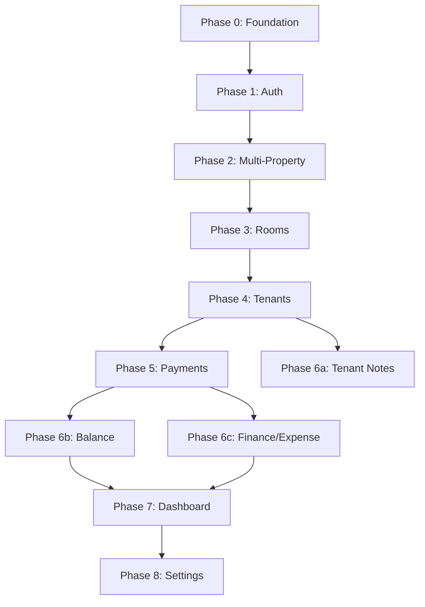

# E-Kost MVP Development Plan

## Current State

Phase 0 (Project Foundation) and Phase 1 (User Authentication) are complete. Implementation includes Next.js app shell, design tokens, i18n, Prisma schema (with client generated to `src/generated/prisma`), Vitest + Playwright config, and full auth flow (registration, login, logout, protected routes, profile dropdown). All feature specs exist under `specs/`; Multi-Property Management (Phase 2) is next.

## Tech Stack Resolution

Use **Next.js App Router** as the full-stack framework. Drop the Vite reference from the README. This gives us:

- React 18 pages via `src/app/` (App Router)
- API routes via `src/app/api/`
- Built-in bundling, no separate Vite config needed
- Tailwind CSS, shadcn/ui, Lucide React for UI
- Prisma + Supabase PostgreSQL for data
- Better Auth with Prisma adapter for auth
- react-i18next for i18n

## Feature Dependency Chain




---

## Phase 0: Project Foundation

**Goal**: Runnable Next.js app with all tooling configured, empty shell ready for features.

**Key files created**:

- `package.json` with all dependencies
- `next.config.mjs`, `tsconfig.json`, `tailwind.config.ts`, `postcss.config.mjs`
- `prisma/schema.prisma` (full schema -- all entities upfront, since they're stable per architecture-intent)
- `src/app/globals.css` (design tokens: CSS variables per [styling rule](d:\Workspace\e-kost.cursor\rules\styling.mdc))
- `src/app/layout.tsx` (root layout with mobile viewport meta, i18n provider)
- `src/lib/i18n.ts` (react-i18next config)
- `locales/en.json`, `locales/id.json` (skeleton translation files)
- `src/lib/prisma.ts` (Prisma client singleton)
- `vitest.config.ts` (test runner config)

**Tasks**:

1. `npx create-next-app@latest` with TypeScript, Tailwind, App Router, `src/` directory
2. Install all dependencies: prisma, @prisma/client, better-auth, zod, react-hook-form, @hookform/resolvers, react-i18next, i18next, lucide-react, date-fns, @tanstack/react-query
3. Install dev deps: vitest, @testing-library/react, @testing-library/jest-dom, msw, @faker-js/faker, fast-check
4. Initialize shadcn/ui (`npx shadcn@latest init`) and add core components (Button, Input, Card, Dialog, DropdownMenu, Select, Form, Label, Badge, Sheet, Tabs, Separator, Toast)
5. Write full Prisma schema with all models (User, Session, Account, Verification, Property, Room, Tenant, Payment, Expense, TenantNote) per [data-architecture.md](specs/data-architecture.md)
6. Configure design tokens in `globals.css` (base UI colors + domain-specific: `--status-available`, `--status-occupied`, `--status-renovation`, `--balance-paid`, `--balance-outstanding`)
7. Set up i18n infrastructure (react-i18next config, locale files, `useTranslation` ready)
8. Create mobile app shell layout: header with app title placeholder, main content area, bottom navigation placeholder
9. Set up Prisma client singleton, env var template (`.env.example`)
10. Run `npx prisma db push` to verify schema against Supabase

**Estimated effort**: 1-2 days

---

## Phase 1: User Authentication (37 tasks -- fully specified)

**Spec**: [specs/user-authentication/tasks.md](specs/user-authentication/tasks.md)

**Layer-by-layer**:

1. **Infrastructure** (tasks 1.1-1.2): Better Auth server config at `src/lib/auth.ts`, client at `src/lib/auth-client.ts`, catch-all route at `src/app/api/auth/[...all]/route.ts`, `useAuth` hook
2. **Backend** (tasks 2.1-2.5): Registration, login, logout wired through Better Auth client. Protected route wrapper component.
3. **UI - Registration** (tasks 3.1-3.4): Registration page at `src/app/(auth)/register/page.tsx` with React Hook Form + Zod validation, mobile-first single-column layout
4. **UI - Login** (tasks 4.1-4.4): Login page at `src/app/(auth)/login/page.tsx`, same pattern
5. **UI - Account Display** (tasks 5.1-5.4): Profile icon with initials, dropdown with name/email/logout, integrated into app header
6. **Session Management** (tasks 6.1-6.2): Expiry handling, redirect on expired session
7. **i18n** (task 7.1): All auth strings extracted to `auth.`* translation keys
8. **Tests** (tasks 8.1-8.7): Registration, login, session, account display, mobile, security, protected routes

**Key architecture decisions**:

- Auth pages use `(auth)` route group with no-auth layout (no header/nav)
- Authenticated pages use `(app)` route group with protected layout wrapper
- Better Auth handles password hashing (bcrypt), session storage (DB), cookie management

**Estimated effort**: 3-4 days

---

## Phase 2: Multi-Property Management (specs needed first)

**Spec status**: Pending -- needs requirements.md, design.md, tasks.md written

**Scope** (inferred from README + architecture-intent):

- Property CRUD: create/read/update/delete properties (name, address)
- Property switcher: dropdown or sheet to switch active property context
- Staff assignment: owner invites staff by email, staff gets access to specific properties
- All subsequent features (rooms, tenants, payments, expenses) are scoped by `propertyId`

**Estimated tasks** (~20):

- Domain: Property entity, validation schemas
- API: CRUD endpoints at `src/app/api/properties/`
- Service: PropertyService with ownership/staff checks
- UI: Property list, create/edit form, property switcher in header, staff invite form
- Middleware: extract `propertyId` from context for all scoped queries
- i18n: property management strings
- Tests

**Why Phase 2**: Every data entity (Room, Tenant, Payment, Expense) has a `propertyId` foreign key. Building property management early prevents retrofitting scoping into every feature later.

**Estimated effort**: 2-3 days

---

## Phase 3: Room Inventory Management (20 tasks -- fully specified)

**Spec**: [specs/room-inventory-management/tasks.md](specs/room-inventory-management/tasks.md)

**Layer-by-layer**:

1. **Schema**: Room model already in Prisma from Phase 0, just verify indexes (status, room_number unique per property)
2. **Service**: RoomService with create, list, get, update, updateStatus. Repository interface `IRoomRepository`.
3. **API** (tasks 2.1-2.4): CRUD + status endpoints at `src/app/api/properties/[propertyId]/rooms/`
4. **UI** (tasks 3.1-3.6):
  - Room list with card layout at `src/app/(app)/rooms/page.tsx`
  - Status filter tabs (all/available/occupied/renovation) with count badges
  - Room detail page at `src/app/(app)/rooms/[roomId]/page.tsx`
  - Create/edit forms using React Hook Form + Zod
  - Status change dropdown/sheet
  - Color-coded status indicators using `--status-`* CSS variables + text labels + icons
5. **i18n** (task 5.1): Room management strings under `rooms.`* keys
6. **Tests** (tasks 4.1-4.6): CRUD workflows, filtering, mobile responsiveness, 500-room performance

**Estimated effort**: 2-3 days

---

## Phase 4: Tenant & Room Basics (21 tasks -- fully specified)

**Spec**: [specs/tenant-room-basics/tasks.md](specs/tenant-room-basics/tasks.md)

**Layer-by-layer**:

1. **Schema**: Tenant model already in Prisma, verify soft-delete (`movedOutAt`) and room FK
2. **Service**: TenantService with CRUD, assignment, move-out logic. Repository interface `ITenantRepository`.
3. **API** (tasks 2.1-2.4, 3.1): CRUD + move-out + room assignment at `src/app/api/properties/[propertyId]/tenants/`
4. **UI** (tasks 4.1-4.6):
  - Tenant list with name + room at `src/app/(app)/tenants/page.tsx`
  - Tenant detail page at `src/app/(app)/tenants/[tenantId]/page.tsx`
  - Create/edit forms
  - Room assignment interface (shows only available rooms)
  - Move-out confirmation dialog (soft delete + room release)
5. **i18n** (tasks 6.1-6.2): Tenant strings under `tenants.`* keys
6. **Tests** (tasks 5.1-5.5): CRUD, assignment, move-out, mobile

**Key behavior**: Move-out sets `movedOutAt`, frees room status to `available`, preserves tenant record for history.

**Estimated effort**: 2-3 days

---

## Phase 5: Payment Recording (17 tasks -- fully specified)

**Spec**: [specs/payment-recording/tasks.md](specs/payment-recording/tasks.md)

**Layer-by-layer**:

1. **Schema**: Payment model already in Prisma, verify indexes (tenant_id, payment_date)
2. **Service**: PaymentService with record, list, listByTenant. Repository interface `IPaymentRepository`.
3. **API** (tasks 2.1-2.3): Record + list + per-tenant list at `src/app/api/properties/[propertyId]/payments/`
4. **UI** (tasks 3.1-3.3):
  - Payment form at `src/app/(app)/payments/new/page.tsx` (3 fields: tenant dropdown, amount, date)
  - Payment list view at `src/app/(app)/payments/page.tsx`
  - Per-tenant payments section in tenant detail page
  - Currency formatting via `Intl.NumberFormat` with locale from i18n config
5. **i18n** (task 5.1): Payment strings under `payments.`* keys
6. **Tests** (tasks 4.1-4.6): Recording, list, per-tenant, persistence, mobile, 10K performance

**Estimated effort**: 2 days

---

## Phase 6a: Tenant Notes (specs needed first)

**Spec status**: Pending

**Scope** (inferred):

- Per-tenant notes CRUD (create, read, update, delete)
- Each note: id, tenantId, content, date, createdAt
- Displayed as a section in tenant detail page
- Sorted by date descending

**Estimated tasks** (~12):

- Service: NoteService, `INoteRepository`
- API: CRUD at `src/app/api/properties/[propertyId]/tenants/[tenantId]/notes/`
- UI: Notes section in tenant detail, add/edit/delete note forms
- i18n, tests

**Estimated effort**: 1-2 days

---

## Phase 6b: Outstanding Balance (14 tasks -- fully specified)

**Spec**: [specs/outstanding-balance/tasks.md](specs/outstanding-balance/tasks.md)

**Layer-by-layer**:

1. **Service** (tasks 1.1, 1.3): BalanceService implementing `IBalanceCalculator`. Formula: `monthlyRent - SUM(payments)`. Computed on-demand, no stored balance. Recalculates on payment or room change.
2. **API** (task 1.2): Balance endpoint at `src/app/api/properties/[propertyId]/tenants/[tenantId]/balance`
3. **UI** (tasks 2.1-2.4):
  - Balance section in tenant detail (balance, rent, total payments)
  - Color-coded status indicators (`--balance-paid` green, `--balance-outstanding` red) with text + icon
  - Balance + status indicator added to tenant list cards
  - Optional sort-by-outstanding in tenant list
4. **i18n** (task 4.1): Balance strings under `balance.`* keys
5. **Tests** (tasks 3.1-3.8): Calculation accuracy, update triggers, display, indicators, mobile, 1K performance

**Estimated effort**: 2 days

---

## Phase 6c: Finance & Expense Tracking (specs needed first)

**Spec status**: Pending

**Scope** (inferred):

- Expense CRUD: category, amount, date, description, scoped per property
- Monthly income view: sum of payments received in a month
- Monthly expense view: sum of expenses in a month
- Category breakdown (pie chart or list)
- Net income: income minus expenses

**Estimated tasks** (~18):

- Domain: Expense entity, categories enum, validation schemas
- Service: ExpenseService, `IExpenseRepository`
- API: CRUD at `src/app/api/properties/[propertyId]/expenses/`
- UI: Expense list, create/edit form, monthly summary page with income/expense/net breakdown
- i18n, tests

**Estimated effort**: 2-3 days

---

## Phase 7: Dashboard / Overview (specs needed first)

**Spec status**: Pending

**Scope** (inferred):

- Landing page after login at `src/app/(app)/page.tsx`
- Occupancy stats: total rooms, occupied count, available count, occupancy rate
- Finance summary: monthly income, monthly expenses, net
- Outstanding balances list: tenants with unpaid balances
- Recent payments: last 5-10 payments

**Estimated tasks** (~12):

- API: Dashboard aggregate endpoint(s)
- UI: Dashboard page with stat cards, recent activity lists
- i18n, tests

**Estimated effort**: 2 days

---

## Phase 8: Settings & Staff Management (specs needed first)

**Spec status**: Pending

**Scope** (inferred):

- Staff management: owner invites/removes staff per property (ties into Phase 2 multi-property)
- User preferences: language selector, potentially currency preference
- Account settings: update name, email

**Estimated tasks** (~15):

- API: Staff invite/remove endpoints, user preference endpoints
- UI: Settings page with sections for staff, language, account
- i18n, tests

**Estimated effort**: 2 days

---

## Cross-Cutting Work (woven into every phase)

These are not separate phases but requirements applied at every step:

- **i18n**: Every user-facing string goes through `useTranslation()`. Add keys to both `en.json` and `id.json`.
- **Mobile-first**: All layouts 320px-480px, 44x44px touch targets, single-column, no horizontal scroll.
- **Accessibility**: Color + text/icon for all indicators, form labels, keyboard nav, WCAG AA contrast.
- **Validation**: Shared Zod schemas between frontend and API routes.
- **Testing**: Unit tests for services, API route tests with MSW, component tests with Testing Library.
- **Currency**: Always use `Intl.NumberFormat` with currency code from i18n config, never hardcode symbols.

---

## Suggested Folder Structure

```
src/
  app/
    (auth)/
      login/page.tsx
      register/page.tsx
      layout.tsx
    (app)/
      page.tsx                    # Dashboard
      rooms/
        page.tsx                  # Room list
        new/page.tsx              # Create room
        [roomId]/page.tsx         # Room detail/edit
      tenants/
        page.tsx                  # Tenant list
        new/page.tsx              # Create tenant
        [tenantId]/page.tsx       # Tenant detail
      payments/
        page.tsx                  # Payment list
        new/page.tsx              # Record payment
      finance/page.tsx            # Finance overview
      settings/page.tsx           # Settings
      layout.tsx                  # Protected layout with header + nav
    api/
      auth/[...all]/route.ts
      properties/
        route.ts
        [propertyId]/
          rooms/route.ts
          rooms/[roomId]/route.ts
          tenants/route.ts
          tenants/[tenantId]/route.ts
          tenants/[tenantId]/notes/route.ts
          tenants/[tenantId]/balance/route.ts
          payments/route.ts
          expenses/route.ts
    globals.css
    layout.tsx
  lib/
    auth.ts                       # Better Auth server
    auth-client.ts                # Better Auth client
    prisma.ts                     # Prisma singleton
    i18n.ts                       # i18n config
  domain/
    schemas/                      # Shared Zod schemas
    interfaces/                   # Repository interfaces
  services/                       # Business logic services
  repositories/                   # Prisma implementations
  components/
    ui/                           # shadcn/ui components
    layout/                       # App shell, header, nav
    rooms/                        # Room-specific components
    tenants/                      # Tenant-specific components
    payments/                     # Payment-specific components
  hooks/                          # Custom React hooks
locales/
  en.json
  id.json
prisma/
  schema.prisma
```

---

## Estimated Timeline Summary


| Phase     | Feature              | Effort          | Status                     |
| --------- | -------------------- | --------------- | -------------------------- |
| 0         | Project Foundation   | 1-2 days        | Ready to start             |
| 1         | User Authentication  | 3-4 days        | Fully specified (37 tasks) |
| 2         | Multi-Property       | 2-3 days        | Needs specs first          |
| 3         | Room Inventory       | 2-3 days        | Fully specified (20 tasks) |
| 4         | Tenant & Room Basics | 2-3 days        | Fully specified (21 tasks) |
| 5         | Payment Recording    | 2 days          | Fully specified (17 tasks) |
| 6a        | Tenant Notes         | 1-2 days        | Needs specs first          |
| 6b        | Outstanding Balance  | 2 days          | Fully specified (14 tasks) |
| 6c        | Finance & Expense    | 2-3 days        | Needs specs first          |
| 7         | Dashboard            | 2 days          | Needs specs first          |
| 8         | Settings & Staff     | 2 days          | Needs specs first          |
| **Total** |                      | **~21-29 days** |                            |


---

## Pre-Implementation Actions Required

Before starting Phase 0:

1. **Update README**: Change "React 18, Vite" to "Next.js (App Router)" in the tech stack table
2. **Write missing specs**: Multi-Property, Dashboard, Finance/Expense, Tenant Notes, Settings each need requirements.md, design.md, and tasks.md
3. **Set up Supabase project**: Create free-tier Supabase project, get `DATABASE_URL` and connection string
4. **Generate `BETTER_AUTH_SECRET`**: Random secret for auth token signing

The missing specs (Phases 2, 6a, 6c, 7, 8) can be written incrementally -- each spec only needs to be done before its phase starts. Phases 0-1 and 3-5 can begin immediately with existing specs.