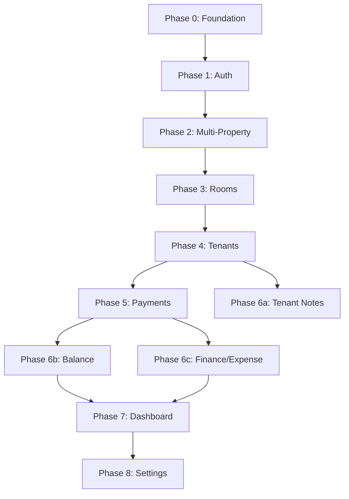

# E-Kost MVP Development Plan

## Current State

Phase 0 (Project Foundation) through Phase 8 (Settings & Staff) are complete. Implementation includes the full stack for each: auth flow; multi-property (Property CRUD, switcher, staff assignment, propertyId scoping); room inventory (domain, RoomService, PrismaRoomRepository, room CRUD + status API, list/detail/forms, status filter/indicators, pages, i18n); tenant & room basics (TenantService, PrismaTenantRepository, tenant CRUD + assign-room + move-out API, list/detail/forms, move-out dialog, pages, i18n, E2E in `e2e/tenant-room-basics/`); payment recording (PaymentService, PrismaPaymentRepository, payment CRUD API, PaymentForm/PaymentList/TenantPaymentSection, payment i18n, E2E in `e2e/payment-recording/`); tenant notes (NoteService, PrismaNoteRepository, note CRUD API, NotesSection/NoteCard/NoteForm in tenant detail, notes i18n, E2E in `e2e/tenant-notes/`); outstanding balance (BalanceService, balance API, BalanceSection/BalanceStatusIndicator in tenant detail and list, E2E in `e2e/outstanding-balance/`); finance & expense (ExpenseService, FinanceSummaryService, expense CRUD API, finance/summary API, finance overview + expenses list/form, E2E in `e2e/finance-expense-tracking/`); dashboard (DashboardService, dashboard API at `api/properties/[propertyId]/dashboard`, OccupancyCard, FinanceSummaryCard, OutstandingBalancesList, RecentPaymentsList, app root as dashboard page, E2E in `e2e/dashboard-overview/`); settings (SettingsPage at /settings, LanguageSelector with AVAILABLE_LOCALES, AccountSection, StaffSection for owners, bottom nav, E2E in `e2e/settings-staff-management/`).

## Feature Development Workflow (TDD)

**Every feature phase (2–8) follows the same 6-step loop.** See [testing.mdc](.cursor/rules/testing.mdc).


| Step  | What                                                                                                                                          | When                       |
| ----- | --------------------------------------------------------------------------------------------------------------------------------------------- | -------------------------- |
| **1** | Define unit/integration tests (Vitest) — Good/Bad/Edge, co-located or in `src/test/`. Use **e-kost-test-author** skill.                       | Before any implementation  |
| **2** | Define E2E tests (Playwright) — atomic user actions in `e2e/<feature>/`. Use **e-kost-e2e-test-author** skill.                                | Before any implementation  |
| **3** | Validate test quality — Gate 1 (validate-tests.ts), Gate 2 (fault injection), Gate 3 (review checklist). Use **e-kost-test-validator** skill. | Before any implementation  |
| **4** | Implement the code — domain → service → API → UI → i18n, layer by layer.                                                                      | After all three gates pass |
| **5** | Iterate until all green — fix failures, re-run feature tests until 0 failures.                                                                | After step 4               |
| **6** | Full regression — run full Vitest + Playwright suites. No regressions in previous features.                                                   | Before phase is complete   |


**Rules:** Implementation subagents must not modify test files. If a regression appears in step 6, fix implementation only. If a fault survives Gate 2, strengthen tests, never weaken them.

## Tech Stack Resolution

Use **Next.js App Router** as the full-stack framework. Drop the Vite reference from the README. This gives us:

- React 18 pages via `src/app/` (App Router)
- API routes via `src/app/api/`
- Built-in bundling, no separate Vite config needed
- Tailwind CSS, shadcn/ui, Lucide React for UI
- Prisma + Supabase PostgreSQL for data
- Better Auth with Prisma adapter for auth
- react-i18next for i18n

## Feature Dependency Chain




---

## Phase 0: Project Foundation

**Goal**: Runnable Next.js app with all tooling configured, empty shell ready for features.

**Key files created**:

- `package.json` with all dependencies
- `next.config.mjs`, `tsconfig.json`, `tailwind.config.ts`, `postcss.config.mjs`
- `prisma/schema.prisma` (full schema -- all entities upfront, since they're stable per architecture-intent)
- `src/app/globals.css` (design tokens: CSS variables per [styling rule](d:\Workspace\e-kost.cursor\rules\styling.mdc))
- `src/app/layout.tsx` (root layout with mobile viewport meta, i18n provider)
- `src/lib/i18n.ts` (react-i18next config)
- `locales/en.json`, `locales/id.json` (skeleton translation files)
- `src/lib/prisma.ts` (Prisma client singleton)
- `vitest.config.ts` (test runner config)

**Tasks**:

1. `npx create-next-app@latest` with TypeScript, Tailwind, App Router, `src/` directory
2. Install all dependencies: prisma, @prisma/client, better-auth, zod, react-hook-form, @hookform/resolvers, react-i18next, i18next, lucide-react, date-fns, @tanstack/react-query
3. Install dev deps: vitest, @testing-library/react, @testing-library/jest-dom, msw, @faker-js/faker, fast-check
4. Initialize shadcn/ui (`npx shadcn@latest init`) and add core components (Button, Input, Card, Dialog, DropdownMenu, Select, Form, Label, Badge, Sheet, Tabs, Separator, Toast)
5. Write full Prisma schema with all models (User, Session, Account, Verification, Property, Room, Tenant, Payment, Expense, TenantNote) per [data-architecture.md](specs/data-architecture.md)
6. Configure design tokens in `globals.css` (base UI colors + domain-specific: `--status-available`, `--status-occupied`, `--status-renovation`, `--balance-paid`, `--balance-outstanding`)
7. Set up i18n infrastructure (react-i18next config, locale files, `useTranslation` ready)
8. Create mobile app shell layout: header with app title placeholder, main content area, bottom navigation placeholder
9. Set up Prisma client singleton, env var template (`.env.example`)
10. Run `npx prisma db push` to verify schema against Supabase

**Estimated effort**: 1-2 days

---

## Phase 1: User Authentication (37 tasks -- fully specified)

**Spec**: [specs/user-authentication/tasks.md](specs/user-authentication/tasks.md)

**Layer-by-layer**:

1. **Infrastructure** (tasks 1.1-1.2): Better Auth server config at `src/lib/auth.ts`, client at `src/lib/auth-client.ts`, catch-all route at `src/app/api/auth/[...all]/route.ts`, `useAuth` hook
2. **Backend** (tasks 2.1-2.5): Registration, login, logout wired through Better Auth client. Protected route wrapper component.
3. **UI - Registration** (tasks 3.1-3.4): Registration page at `src/app/(auth)/register/page.tsx` with React Hook Form + Zod validation, mobile-first single-column layout
4. **UI - Login** (tasks 4.1-4.4): Login page at `src/app/(auth)/login/page.tsx`, same pattern
5. **UI - Account Display** (tasks 5.1-5.4): Profile icon with initials, dropdown with name/email/logout, integrated into app header
6. **Session Management** (tasks 6.1-6.2): Expiry handling, redirect on expired session
7. **i18n** (task 7.1): All auth strings extracted to `auth.`* translation keys
8. **Tests** (tasks 8.1-8.7): Registration, login, session, account display, mobile, security, protected routes

**Key architecture decisions**:

- Auth pages use `(auth)` route group with no-auth layout (no header/nav)
- Authenticated pages use `(app)` route group with protected layout wrapper
- Better Auth handles password hashing (bcrypt), session storage (DB), cookie management

**Estimated effort**: 3-4 days

---

## Phase 2: Multi-Property Management

**Spec**: [specs/multi-property-management/requirements.md](specs/multi-property-management/requirements.md), [design.md](specs/multi-property-management/design.md), [tasks.md](specs/multi-property-management/tasks.md)

**Scope**: Property CRUD (name, address); property switcher; staff assignment (owner invites by email); all subsequent features scoped by `propertyId`.

**Workflow (TDD)**:

- **Steps 1–3 (tests first):** Write Vitest tests for PropertyService, property API routes, and property UI components (Good/Bad/Edge). Write Playwright E2E tests in `e2e/multi-property-management/` for create property, switch property, staff invite. Run `npx tsx scripts/validate-tests.ts --feature multi-property-management`, then Gate 2 (fault injection) and Gate 3 (review checklist). No implementation until all three gates pass.
- **Steps 4–6 (implementation):** Follow [tasks.md](specs/multi-property-management/tasks.md): domain (Property entity, Zod, IPropertyRepository) → PropertyService + staff logic → Prisma repository → API at `src/app/api/properties/` → UI (list, form, switcher, staff invite) → middleware for `propertyId` context → i18n. Iterate until feature tests pass, then full Vitest + Playwright regression.

**Why Phase 2**: Every data entity (Room, Tenant, Payment, Expense) has a `propertyId` foreign key. Building property management early prevents retrofitting scoping into every feature later.

**Estimated effort**: 2-3 days

---

## Phase 3: Room Inventory Management (20 tasks -- fully specified)

**Spec**: [specs/room-inventory-management/tasks.md](specs/room-inventory-management/tasks.md)

**Workflow (TDD)**:

- **Steps 1–3 (tests first):** Write Vitest tests for RoomService, room API routes, and room UI (Good/Bad/Edge). Write Playwright E2E tests in `e2e/room-inventory-management/` for create room, edit room, filter by status, change status. Run `npx tsx scripts/validate-tests.ts --feature room-inventory-management`, then Gate 2 and Gate 3. No implementation until all three gates pass.
- **Steps 4–6 (implementation):** Schema verification → RoomService + `IRoomRepository` → API at `src/app/api/properties/[propertyId]/rooms/` → UI (list, detail, forms, status filter, status change, indicators) → i18n (`rooms.`*). Iterate until green, then full regression.

**Implementation scope** (layer-by-layer): Room model indexes; RoomService create/list/get/update/updateStatus; CRUD + status API; room list with card layout and filter tabs; room detail; create/edit forms; status change; color-coded indicators (`--status-`* + text + icons); 500-room performance.

**Estimated effort**: 2-3 days

---

## Phase 4: Tenant & Room Basics (21 tasks -- fully specified)

**Spec**: [specs/tenant-room-basics/tasks.md](specs/tenant-room-basics/tasks.md)

**Workflow (TDD)**:

- **Steps 1–3 (tests first):** Write Vitest tests for TenantService, tenant API routes, and tenant UI (Good/Bad/Edge). Write Playwright E2E tests in `e2e/tenant-room-basics/` for create tenant, assign room, move-out. Run `npx tsx scripts/validate-tests.ts --feature tenant-room-basics`, then Gate 2 and Gate 3. No implementation until all three gates pass.
- **Steps 4–6 (implementation):** Schema verification (soft-delete, room FK) → TenantService + `ITenantRepository` → API (CRUD + move-out + assignment) → UI (list, detail, forms, room assignment, move-out dialog) → i18n (`tenants.`*). Iterate until green, then full regression.

**Key behavior**: Move-out sets `movedOutAt`, frees room status to `available`, preserves tenant record for history.

**Estimated effort**: 2-3 days

---

## Phase 5: Payment Recording (17 tasks -- fully specified)

**Spec**: [specs/payment-recording/tasks.md](specs/payment-recording/tasks.md)

**Workflow (TDD)**:

- **Steps 1–3 (tests first):** Write Vitest tests for PaymentService, payment API routes, and payment UI (Good/Bad/Edge). Write Playwright E2E tests in `e2e/payment-recording/` for record payment, view list, per-tenant view. Run `npx tsx scripts/validate-tests.ts --feature payment-recording`, then Gate 2 and Gate 3. No implementation until all three gates pass.
- **Steps 4–6 (implementation):** Schema verification → PaymentService + `IPaymentRepository` → API (record, list, per-tenant) → UI (payment form, list, tenant detail section, currency via i18n) → i18n (`payments.`*). Iterate until green, then full regression. Ensure 10K-performance tests pass.

**Estimated effort**: 2 days

---

## Phase 6a: Tenant Notes

**Spec**: [specs/tenant-notes/requirements.md](specs/tenant-notes/requirements.md), [design.md](specs/tenant-notes/design.md), [tasks.md](specs/tenant-notes/tasks.md)

**Scope**: Per-tenant notes CRUD (TenantNote: content, date); notes section in tenant detail; sorted by date descending.

**Workflow (TDD)**:

- **Steps 1–3 (tests first):** Write Vitest tests for NoteService, notes API routes, and notes UI (Good/Bad/Edge). Write Playwright E2E tests in `e2e/tenant-notes/` for add note, edit note, delete note. Run `npx tsx scripts/validate-tests.ts --feature tenant-notes`, then Gate 2 and Gate 3. No implementation until gates pass.
- **Steps 4–6 (implementation):** Follow [tasks.md](specs/tenant-notes/tasks.md): domain (TenantNote, Zod, INoteRepository) → NoteService → Prisma repository → API at `src/app/api/properties/[propertyId]/tenants/[tenantId]/notes/` → UI (notes section in tenant detail, add/edit/delete) → i18n. Iterate until green, then full regression.

**Estimated effort**: 1-2 days

---

## Phase 6b: Outstanding Balance (14 tasks -- fully specified)

**Spec**: [specs/outstanding-balance/tasks.md](specs/outstanding-balance/tasks.md)

**Workflow (TDD)**:

- **Steps 1–3 (tests first):** Write Vitest tests for BalanceService (`IBalanceCalculator`), balance API, and balance UI (Good/Bad/Edge). Write Playwright E2E tests in `e2e/outstanding-balance/` for balance display in tenant detail and list. Run `npx tsx scripts/validate-tests.ts --feature outstanding-balance`, then Gate 2 and Gate 3. No implementation until gates pass.
- **Steps 4–6 (implementation):** BalanceService (formula: monthlyRent - SUM(payments), on-demand) → balance API → UI (tenant detail section, list indicators, sort-by-outstanding) → i18n (`balance.`*). Iterate until green, then full regression. Ensure 1K-performance tests pass.

**Estimated effort**: 2 days

---

## Phase 6c: Finance & Expense Tracking

**Spec**: [specs/finance-expense-tracking/requirements.md](specs/finance-expense-tracking/requirements.md), [design.md](specs/finance-expense-tracking/design.md), [tasks.md](specs/finance-expense-tracking/tasks.md)

**Scope**: Expense CRUD (category, amount, date, description); ExpenseService + FinanceSummaryService; monthly income/expense and category breakdown; net income.

**Workflow (TDD)**:

- **Steps 1–3 (tests first):** Write Vitest tests for ExpenseService, FinanceSummaryService, expense API, and finance UI (Good/Bad/Edge). Write Playwright E2E tests in `e2e/finance-expense-tracking/` for add expense, view monthly summary. Run `npx tsx scripts/validate-tests.ts --feature finance-expense-tracking`, then Gate 2 and Gate 3. No implementation until gates pass.
- **Steps 4–6 (implementation):** Follow [tasks.md](specs/finance-expense-tracking/tasks.md): domain (Expense entity, categories enum, Zod, IExpenseRepository) → ExpenseService + FinanceSummaryService → Prisma repository → API at `src/app/api/properties/[propertyId]/expenses/` → UI (expense list/form, monthly summary, breakdown) → i18n. Iterate until green, then full regression.

**Estimated effort**: 2-3 days

---

## Phase 7: Dashboard / Overview

**Spec**: [specs/dashboard-overview/requirements.md](specs/dashboard-overview/requirements.md), [design.md](specs/dashboard-overview/design.md), [tasks.md](specs/dashboard-overview/tasks.md)

**Scope**: Landing at `(app)/page.tsx`; DashboardService aggregating RoomService, PaymentService, ExpenseService, BalanceService; occupancy stats; finance summary; outstanding balances list; recent payments.

**Workflow (TDD)**:

- **Steps 1–3 (tests first):** Write Vitest tests for DashboardService, dashboard API, and dashboard UI (Good/Bad/Edge). Write Playwright E2E tests in `e2e/dashboard-overview/` for dashboard load and displayed stats. Run `npx tsx scripts/validate-tests.ts --feature dashboard-overview`, then Gate 2 and Gate 3. No implementation until gates pass.
- **Steps 4–6 (implementation):** Follow [tasks.md](specs/dashboard-overview/tasks.md): DashboardService + additions to RoomService, BalanceService, PaymentService → dashboard API → UI (stat cards, recent activity, balances list) → i18n. Iterate until green, then full regression.

**Estimated effort**: 2 days

---

## Phase 8: Settings & Staff Management

**Spec**: [specs/settings-staff-management/requirements.md](specs/settings-staff-management/requirements.md), [design.md](specs/settings-staff-management/design.md), [tasks.md](specs/settings-staff-management/tasks.md)

**Scope**: Settings page (Language, Account, Staff sections); LanguageSelector with options derived from which locale JSON files exist in `locales/` (one option per file); AccountSection (name edit); StaffSection (invite/remove, owner-only); staff API from Phase 2.

**Workflow (TDD)**:

- **Steps 1–3 (tests first):** Write Vitest tests for settings API (where applicable) and settings UI (Good/Bad/Edge). Write Playwright E2E tests in `e2e/settings-staff-management/` for change language, update account, invite/remove staff. Run `npx tsx scripts/validate-tests.ts --feature settings-staff-management`, then Gate 2 and Gate 3. No implementation until gates pass.
- **Steps 4–6 (implementation):** Follow [tasks.md](specs/settings-staff-management/tasks.md): Settings page layout → LanguageSelector, AccountSection, StaffSection → staff/preference API as needed → i18n. Iterate until green, then full regression.

**Estimated effort**: 2 days

---

## Cross-Cutting Work (woven into every phase)

These are not separate phases but requirements applied at every step:

- **i18n**: Every user-facing string goes through `useTranslation()`. Add keys to both `en.json` and `id.json`.
- **Mobile-first**: All layouts 320px-480px, 44x44px touch targets, single-column, no horizontal scroll.
- **Accessibility**: Color + text/icon for all indicators, form labels, keyboard nav, WCAG AA contrast.
- **Validation**: Shared Zod schemas between frontend and API routes.
- **Testing**: TDD workflow — tests first (Vitest + Playwright Tier 1), quality gates, then implementation. Unit/API/component tests with Good/Bad/Edge; E2E in `e2e/<feature>/`. Tier 2 journey tests (`e2e/journeys/`) are written after Phase 8.
- **Currency**: Always use `Intl.NumberFormat` with currency code from i18n config, never hardcode symbols.

---

## Suggested Folder Structure

```
src/
  app/
    (auth)/
      login/page.tsx
      register/page.tsx
      layout.tsx
    (app)/
      page.tsx                    # Dashboard (OccupancyCard, FinanceSummaryCard, OutstandingBalancesList, RecentPaymentsList)
      properties/
        page.tsx                  # Property list
        new/page.tsx              # Create property
        [propertyId]/
          rooms/page.tsx
          rooms/new/page.tsx
          rooms/[roomId]/page.tsx
          tenants/page.tsx
          tenants/new/page.tsx
          tenants/[tenantId]/page.tsx
          payments/page.tsx
          payments/new/page.tsx
          finance/page.tsx
          finance/expenses/page.tsx
          finance/expenses/new/page.tsx
          finance/expenses/[expenseId]/edit/page.tsx
      settings/page.tsx           # Settings (Phase 8 — not yet)
      layout.tsx                  # Protected layout with header + nav
    api/
      auth/[...all]/route.ts
      properties/
        route.ts
        [propertyId]/
          route.ts
          rooms/route.ts
          rooms/[roomId]/route.ts
          rooms/[roomId]/status/route.ts
          dashboard/route.ts
          tenants/route.ts
          tenants/[tenantId]/route.ts
          tenants/[tenantId]/assign-room/route.ts
          tenants/[tenantId]/move-out/route.ts
          tenants/[tenantId]/payments/route.ts
          tenants/[tenantId]/balance/route.ts
          tenants/[tenantId]/notes/route.ts
          tenants/[tenantId]/notes/[noteId]/route.ts
          staff/route.ts
          staff/[userId]/route.ts
          payments/route.ts
          balances/route.ts
          expenses/route.ts
          expenses/[expenseId]/route.ts
          finance/summary/route.ts
    globals.css
    layout.tsx
  lib/
    auth.ts                       # Better Auth server
    auth-client.ts                # Better Auth client
    prisma.ts                     # Prisma singleton
    i18n.ts                       # i18n config
    *-service.ts                  # Business logic (property, room, tenant, payment, balance, expense, finance-summary, note, dashboard)
    repositories/
      prisma/                     # Prisma repository implementations
      stub-*.ts                    # Stubs for tests
  domain/
    schemas/                      # Shared Zod schemas
    interfaces/                   # Repository interfaces
  components/
    ui/                           # shadcn/ui components
    layout/                       # App shell, header, nav
    auth/                         # Auth-related components
    property/                     # Property CRUD, switcher
    dashboard/                    # OccupancyCard, FinanceSummaryCard, OutstandingBalancesList, RecentPaymentsList
    room/                         # Room form, list, filter, cards, status indicator
    tenant/                       # Tenant form, assign room, move-out
    payment/                     # Payment form, list, per-tenant section
    balance/                     # Balance section, status indicator
    expense/                     # Expense form, list
    finance/                     # Month selector, summary cards, category breakdown
    notes/                       # Note form, note card, notes section
  hooks/                          # Custom React hooks
locales/
  en.json
  id.json
prisma/
  schema.prisma
```

---

## Estimated Timeline Summary


| Phase     | Feature              | Effort          | Specs                                       |
| --------- | -------------------- | --------------- | ------------------------------------------- |
| 0         | Project Foundation   | 1-2 days        | —                                           |
| 1         | User Authentication  | 3-4 days        | specs/user-authentication/                  |
| 2         | Multi-Property       | 2-3 days        | specs/multi-property-management/            |
| 3         | Room Inventory       | 2-3 days        | specs/room-inventory-management/            |
| 4         | Tenant & Room Basics | 2-3 days        | specs/tenant-room-basics/                   |
| 5         | Payment Recording    | 2 days          | specs/payment-recording/                    |
| 6a        | Tenant Notes         | 1-2 days        | specs/tenant-notes/                         |
| 6b        | Outstanding Balance  | 2 days          | specs/outstanding-balance/                  |
| 6c        | Finance & Expense    | 2-3 days        | specs/finance-expense-tracking/             |
| 7         | Dashboard            | 2 days          | specs/dashboard-overview/                   |
| 8         | Settings & Staff     | 2 days          | specs/settings-staff-management/            |
| **Total** |                      | **~21-29 days** | All phases have requirements, design, tasks |


---

## Pre-Implementation Actions Required

Before starting Phase 0 (if starting from scratch):

1. **Update README**: Change "React 18, Vite" to "Next.js (App Router)" in the tech stack table
2. **Set up Supabase project**: Create free-tier Supabase project, get `DATABASE_URL` and connection string
3. **Generate `BETTER_AUTH_SECRET`**: Random secret for auth token signing

**Specs**: All feature specs exist under `specs/<feature>/` with requirements.md, design.md, and tasks.md (user-authentication, multi-property-management, room-inventory-management, tenant-room-basics, payment-recording, tenant-notes, outstanding-balance, finance-expense-tracking, dashboard-overview, settings-staff-management). For every phase, **tests (steps 1–3) are written and validated before any implementation (steps 4–6)**. E2E test folders must match spec names (`e2e/<feature>/`) for `validate-tests.ts --feature <feature>`. After Phase 8, add Tier 2 journey tests in `e2e/journeys/`.