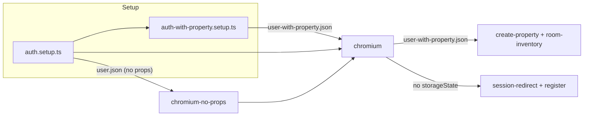

# Fix E2E Test Failures

## Root causes (from prior review)

| Failure group            | Cause                                                                                                                                                                             |
| ------------------------ | --------------------------------------------------------------------------------------------------------------------------------------------------------------------------------- |
| **Room inventory (8)**   | E2E user has **no properties**; the "Rooms" link only renders when the user has at least one property (`[src/app/(app)/page.tsx](src/app/(app)`/page.tsx) lines 56–70 vs 92–105). |
| **Create property (4)**  | Same user (no properties); going to `/properties/new` may still work, but sharing the "user with property" state keeps behavior consistent and avoids redirect/loading races.     |
| **Session redirect (2)** | Possible race: assertion runs before redirect completes, or "Dashboard" appears briefly; "login page accessible" may hit redirect if context is not clean.                        |
| **Register (2)**         | Redirect to `"/"` after signup not completing within 20s (timing or env).                                                                                                         |

## Approach: two auth states

Keep the existing "user with no properties" state for **switch-property** tests. Add a second state **"user with one property"** for specs that need the dashboard "Rooms" link or a stable app state (create-property, room-inventory).

---

## 1. Add "user with property" setup

**New file:** `[e2e/setup/auth-with-property.setup.ts](e2e/setup/auth-with-property.setup.ts)`

- Use storage state from `e2e/.auth/user.json` (created by existing auth setup).
- Create **one property via API** (faster and more reliable than UI):
  - Use the same context so cookies are sent: e.g. `request.post(baseURL + "/api/properties", { data: { name: "E2E Property", address: "123 E2E Street" } })` from a context loaded with `user.json`.
- Save context storage state to `**e2e/.auth/user-with-property.json`** (same cookies; server now has one property for this user).

Implementation detail: In Playwright, use a fixture or `test.beforeAll` with a context that has `storageState: "e2e/.auth/user.json"`, then call `request.post(...)` (request inherits cookies from the same context), then `context.storageState({ path: "e2e/.auth/user-with-property.json" })`. If the setup runs as a separate project, run one "setup" test that does: get default page (with user.json), use `page.request.post(...)`, then save storage state.

---

## 2. Playwright config: new project and dependencies

**File:** `[playwright.config.ts](playwright.config.ts)`

- Add project `**setup-with-property`**:
  - `testMatch`: match the new setup file (e.g. `auth-with-property.setup.ts`).
  - `dependencies: ["setup"]`.
- Update `**chromium`** project:
  - Set `dependencies: ["chromium-no-props", "setup-with-property"]` so both run before chromium.
- Resulting order: **setup** → **chromium-no-props** and **setup-with-property** (parallel) → **chromium**.

---

## 3. Point specs that need a property to the new state

**Files to update:**

- `[e2e/multi-property-management/create-property.spec.ts](e2e/multi-property-management/create-property.spec.ts)`: change `test.use({ storageState: "e2e/.auth/user-with-property.json" })`.
- `[e2e/room-inventory/create-room.spec.ts](e2e/room-inventory/create-room.spec.ts)`: same.
- `[e2e/room-inventory/filter-rooms.spec.ts](e2e/room-inventory/filter-rooms.spec.ts)`: same.
- `[e2e/room-inventory/update-status.spec.ts](e2e/room-inventory/update-status.spec.ts)`: same.

**Leave as-is:** `[e2e/multi-property-management/switch-property.spec.ts](e2e/multi-property-management/switch-property.spec.ts)` and `[e2e/auth/logout.spec.ts](e2e/auth/logout.spec.ts)` keep using `e2e/.auth/user.json` (no property).

---

## 4. Harden session-redirect specs

**File:** `[e2e/auth/session-redirect.spec.ts](e2e/auth/session-redirect.spec.ts)`

- **"unauthenticated user cannot see dashboard content"**: After `expect(page).toHaveURL(/\/login/, { timeout: 10000 })`, wait for the **login form** to be visible (e.g. `await expect(page.getByLabel(/email address/i)).toBeVisible({ timeout: 5000 })`) before `expect(page.getByText(/dashboard/i)).not.toBeVisible()`. This avoids asserting on a half-redirected page where "Dashboard" might still be in the DOM.
- **"login page is accessible without authentication"**: Ensure no global storage state is applied for this describe (already the case). Optionally add a short wait for the login form after navigation so the page is fully loaded before assertions.

No change to session-redirect’s use of storage state (none) so unauthenticated tests keep a clean context.

---

## 5. Harden register specs (optional)

**File:** `[e2e/auth/register.spec.ts](e2e/auth/register.spec.ts)`

- For **"user registers with valid credentials and lands on app"** and **"user can register with exactly 8-character password"**: Increase redirect timeout from 20000 to 25000–30000 ms, or use `page.waitForURL("/", { timeout: 25000 })` after click and then assert URL. This reduces flakiness if the redirect is slow under load.
- If failures persist, add a short wait for a stable indicator on the dashboard (e.g. "Dashboard" heading or "Create property" / "Rooms") after navigation instead of only relying on URL.

---

## 6. .gitignore

Ensure `**e2e/.auth/`** is gitignored (auth state files should not be committed). If not already present, add `e2e/.auth/` to `[.gitignore](.gitignore)`.

---

## Verification

- Run full E2E suite: `npx playwright test`.
- Confirm: setup runs first, then chromium-no-props and setup-with-property, then chromium.
- All room-inventory, create-property, session-redirect, and register specs should pass (or be clearly isolated if any remain flaky).

---

## Summary of file changes

| Action            | File                                                                                 |
| ----------------- | ------------------------------------------------------------------------------------ |
| Create            | `e2e/setup/auth-with-property.setup.ts`                                              |
| Edit              | `playwright.config.ts` (add project, adjust chromium deps)                           |
| Edit              | `e2e/multi-property-management/create-property.spec.ts` (storageState)               |
| Edit              | `e2e/room-inventory/create-room.spec.ts` (storageState)                              |
| Edit              | `e2e/room-inventory/filter-rooms.spec.ts` (storageState)                             |
| Edit              | `e2e/room-inventory/update-status.spec.ts` (storageState)                            |
| Edit              | `e2e/auth/session-redirect.spec.ts` (wait for login form before dashboard assertion) |
| Edit (optional)   | `e2e/auth/register.spec.ts` (longer redirect timeout / wait)                         |
| Edit (if missing) | `.gitignore` (e2e/.auth/)                                                            |

