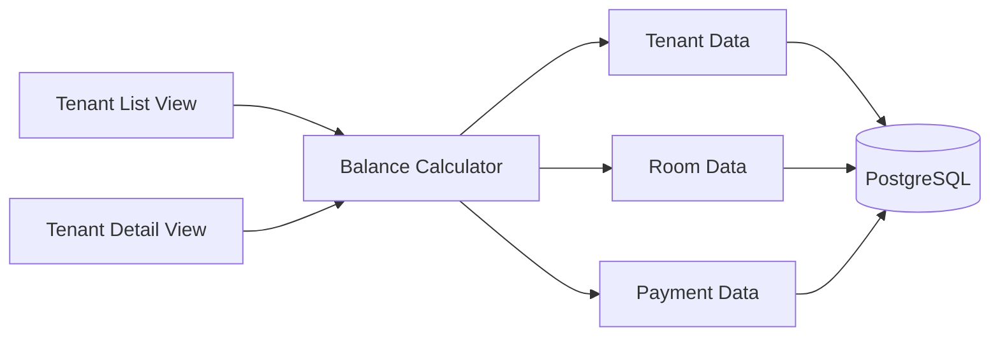
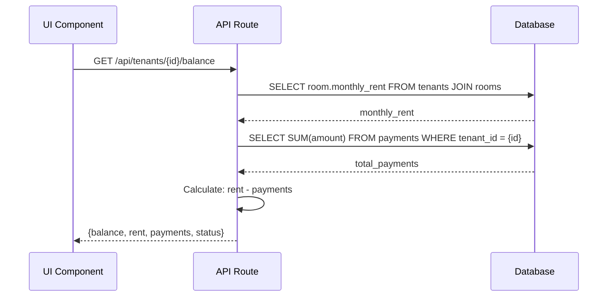

# Design: Outstanding Balance per Tenant

## Overview

The Outstanding Balance feature calculates and displays how much each tenant owes based on their room's monthly rent minus recorded payments. This feature provides property managers with immediate visibility into payment status through color-coded indicators optimized for mobile viewing.

### Key Design Decisions

**Calculation Strategy**: Outstanding balance is computed on-demand rather than stored, ensuring real-time accuracy when payments or room assignments change. The formula is: `outstanding_balance = room.monthly_rent - SUM(payments.amount)`.

**Display Strategy**: Balance information is surfaced in two primary locations: (1) tenant detail view with full breakdown, and (2) tenant list view with glanceable status indicators. Both views prioritize mobile-first design with single-column layouts and 44x44px touch targets.

**Status Indicators**: A dual-encoding approach (color + text/icon) ensures accessibility while providing quick visual scanning. Green/paid for zero balance, red/unpaid for outstanding amounts.

**Performance**: For 1,000 tenants with 10,000 payments, balance calculations execute via indexed SQL queries completing in <100ms, well within the 2-second response time requirement.

## Architecture

### System Context

The Outstanding Balance feature integrates with three existing components:

1. **Tenant Management**: Reads tenant records and room assignments
2. **Room Inventory**: Reads monthly rent amounts from room records
3. **Payment Recording**: Reads payment records to sum total payments per tenant



### Calculation Flow



## Components and Interfaces

### 1. Balance Calculator Service

**Responsibility**: Compute outstanding balance for a single tenant or batch of tenants.

**Interface**:
```typescript
interface BalanceCalculator {
  // Calculate balance for a single tenant
  calculateBalance(tenantId: string): Promise<BalanceResult>;
  
  // Calculate balances for multiple tenants (optimized batch query)
  calculateBalances(tenantIds: string[]): Promise<Map<string, BalanceResult>>;
}

interface BalanceResult {
  tenantId: string;
  monthlyRent: number;
  totalPayments: number;
  outstandingBalance: number;
  status: 'paid' | 'unpaid';
}
```

**Implementation Notes**:
- Single tenant: JOIN query combining tenant, room, and aggregated payments
- Batch calculation: Single query with GROUP BY for list views
- Status determination: `status = outstandingBalance <= 0 ? 'paid' : 'unpaid'`

### 2. API Routes

**GET /api/tenants/:id/balance**
- Returns balance calculation for a single tenant
- Response time: <100ms (indexed query)
- Used by: Tenant detail view

**GET /api/tenants/balances**
- Returns balance calculations for all tenants
- Optional query param: `?status=unpaid` to filter
- Response time: <500ms for 1,000 tenants
- Used by: Tenant list view

**Response Schema**:
```typescript
{
  tenantId: string;
  tenantName: string;
  roomNumber: string;
  monthlyRent: number;
  totalPayments: number;
  outstandingBalance: number;
  status: 'paid' | 'unpaid';
}
```

### 3. UI Components

**BalanceCard Component** (Tenant Detail View)
- Displays full balance breakdown
- Shows: monthly rent, total payments, outstanding balance
- Color-coded status badge
- Mobile-optimized: single column, large text

**BalanceIndicator Component** (Tenant List View)
- Compact status display
- Shows: balance amount + status icon
- Color-coded: green (paid) / red (unpaid)
- Touch target: 44x44px minimum

**TenantListItem Component** (Enhanced)
- Integrates BalanceIndicator
- Single-column card layout
- Displays: name, room, balance, status

## Data Models

### Database Schema

No new tables required. Outstanding balance is computed from existing tables:

**Existing Tables Used**:
```sql
-- Tenants table (from tenant-room-basics)
tenants (
  id UUID PRIMARY KEY,
  name VARCHAR(255),
  phone VARCHAR(50),
  email VARCHAR(255),
  room_id UUID REFERENCES rooms(id),
  created_at TIMESTAMP,
  moved_out_at TIMESTAMP
)

-- Rooms table (from room-inventory-management)
rooms (
  id UUID PRIMARY KEY,
  room_number VARCHAR(50),
  room_type VARCHAR(100),
  monthly_rent DECIMAL(10,2),
  status VARCHAR(50),
  created_at TIMESTAMP
)

-- Payments table (from payment-recording)
payments (
  id UUID PRIMARY KEY,
  tenant_id UUID REFERENCES tenants(id),
  amount DECIMAL(10,2),
  payment_date DATE,
  created_at TIMESTAMP
)
```

### Indexes for Performance

```sql
-- Existing indexes assumed from prior features
CREATE INDEX idx_tenants_room_id ON tenants(room_id);
CREATE INDEX idx_payments_tenant_id ON payments(tenant_id);

-- Additional index for balance queries
CREATE INDEX idx_tenants_moved_out ON tenants(moved_out_at) 
  WHERE moved_out_at IS NULL;
```

### SQL Query for Balance Calculation

**Single Tenant**:
```sql
SELECT 
  t.id as tenant_id,
  t.name as tenant_name,
  r.room_number,
  r.monthly_rent,
  COALESCE(SUM(p.amount), 0) as total_payments,
  r.monthly_rent - COALESCE(SUM(p.amount), 0) as outstanding_balance
FROM tenants t
JOIN rooms r ON t.room_id = r.id
LEFT JOIN payments p ON p.tenant_id = t.id
WHERE t.id = $1 AND t.moved_out_at IS NULL
GROUP BY t.id, t.name, r.room_number, r.monthly_rent;
```

**All Tenants (Batch)**:
```sql
SELECT 
  t.id as tenant_id,
  t.name as tenant_name,
  r.room_number,
  r.monthly_rent,
  COALESCE(SUM(p.amount), 0) as total_payments,
  r.monthly_rent - COALESCE(SUM(p.amount), 0) as outstanding_balance
FROM tenants t
JOIN rooms r ON t.room_id = r.id
LEFT JOIN payments p ON p.tenant_id = t.id
WHERE t.moved_out_at IS NULL
GROUP BY t.id, t.name, r.room_number, r.monthly_rent
ORDER BY outstanding_balance DESC;
```

### Data Flow

1. **Payment Recorded**: UI calls payment API → Database updated → UI refetches balance
2. **Room Assignment Changed**: UI calls tenant update API → Database updated → UI refetches balance
3. **Tenant Moved Out**: Tenant marked with `moved_out_at` → Excluded from active balance queries

## Correctness Properties

*A property is a characteristic or behavior that should hold true across all valid executions of a system—essentially, a formal statement about what the system should do. Properties serve as the bridge between human-readable specifications and machine-verifiable correctness guarantees.*


### Property 1: Balance Calculation Formula

*For any* tenant with a room assignment and any set of payment records, the outstanding balance should equal the room's monthly rent minus the sum of all payment amounts for that tenant.

**Validates: Requirements 1.1, 1.2, 1.3**

### Property 2: Paid Status Determination

*For any* tenant, when the total payments equal or exceed the monthly rent, the status should be 'paid' and the outstanding balance should be zero or negative.

**Validates: Requirements 1.5, 3.1, 3.2**

### Property 3: Balance Updates on Payment

*For any* tenant with an existing balance, when a new payment is recorded, the outstanding balance should decrease by exactly the payment amount.

**Validates: Requirements 1.6, 5.1**

### Property 4: Balance Updates on Room Change

*For any* tenant, when assigned to a different room, the outstanding balance should be recalculated using the new room's monthly rent while preserving the same total payments.

**Validates: Requirements 1.6, 5.2**

### Property 5: Balance Display Completeness

*For any* tenant balance display, the rendered output should contain the monthly rent amount, total payments amount, and outstanding balance amount.

**Validates: Requirements 2.2, 2.3, 2.4**

### Property 6: Status Indicator Accessibility

*For any* status indicator, the rendered output should include both a color designation (CSS class) and text or icon content to convey status without relying on color alone.

**Validates: Requirements 3.5**

### Property 7: List Item Balance Presence

*For any* tenant in the list view, the rendered list item should include both the outstanding balance amount and a status indicator.

**Validates: Requirements 4.1, 4.2**

### Property 8: Balance Sorting Order

*For any* tenant list sorted by outstanding balance, tenants with higher outstanding balances should appear before tenants with lower balances.

**Validates: Requirements 4.4**

### Property 9: Moved-Out Balance Preservation

*For any* tenant marked as moved out, the outstanding balance calculation should still be computable using the tenant's last room assignment and all recorded payments.

**Validates: Requirements 5.3**

### Property 10: Currency Formatting

*For any* balance amount displayed, the formatted string should include exactly two decimal places and respect locale-specific decimal separators.

**Validates: Requirements 2.2, Constraints**

## Error Handling

### Calculation Errors

**Missing Room Assignment**:
- Scenario: Tenant has no room_id (data integrity issue)
- Handling: Return error response with 400 status code
- Message: "Cannot calculate balance: tenant has no room assignment"
- UI: Display error message in balance section

**Invalid Payment Data**:
- Scenario: Payment amount is negative or null
- Handling: Database constraint prevents insertion
- Fallback: If data exists, exclude from sum and log warning
- UI: Display warning indicator if payments are suspect

**Database Query Failure**:
- Scenario: Database connection timeout or query error
- Handling: Return 500 status code with generic error message
- Retry: Implement exponential backoff for transient failures
- UI: Display "Unable to load balance" with retry button

### Display Errors

**Missing Translation Keys**:
- Scenario: Translation key not found in locale file
- Handling: Fall back to English key or display key name
- Logging: Log missing keys for developer attention
- UI: Display fallback text without breaking layout

**Rendering Failures**:
- Scenario: Component fails to render due to invalid props
- Handling: React error boundary catches error
- Fallback: Display simplified balance text without styling
- Logging: Log error details for debugging

### Performance Degradation

**Slow Query Response**:
- Scenario: Balance query takes >2 seconds
- Handling: Display loading indicator after 500ms
- Timeout: Cancel request after 5 seconds
- UI: Show timeout message with retry option

**Batch Query Optimization**:
- Scenario: Loading 1,000+ tenant balances
- Handling: Use pagination (50 tenants per page)
- Optimization: Implement virtual scrolling for large lists
- Caching: Cache balance results for 30 seconds

## Testing Strategy

### Dual Testing Approach

This feature requires both unit tests and property-based tests to ensure comprehensive coverage:

**Unit Tests**: Focus on specific examples, edge cases, and integration points
- Example: Tenant with zero payments shows balance equal to rent
- Example: Tenant with payments exceeding rent shows paid status
- Edge case: Tenant with no room assignment returns error
- Integration: API route returns correct response format

**Property-Based Tests**: Verify universal properties across all inputs
- Property tests handle comprehensive input coverage through randomization
- Each property test runs minimum 100 iterations
- Properties validate correctness across the full input space

### Property-Based Testing Configuration

**Library**: fast-check (JavaScript/TypeScript property-based testing library)

**Configuration**:
```typescript
import fc from 'fast-check';

// Minimum 100 iterations per property test
fc.assert(property, { numRuns: 100 });
```

**Test Tagging**: Each property test must include a comment referencing the design property:
```typescript
// Feature: outstanding-balance, Property 1: Balance Calculation Formula
test('balance equals rent minus payments', () => {
  fc.assert(
    fc.property(
      tenantArbitrary,
      roomArbitrary,
      fc.array(paymentArbitrary),
      (tenant, room, payments) => {
        const balance = calculateBalance(tenant, room, payments);
        const expected = room.monthlyRent - sum(payments.map(p => p.amount));
        expect(balance.outstandingBalance).toBe(expected);
      }
    ),
    { numRuns: 100 }
  );
});
```

### Test Coverage Requirements

**Unit Tests**:
- Balance calculation with various payment scenarios (5-10 tests)
- Status determination edge cases (3-5 tests)
- API route response format validation (3-5 tests)
- Error handling scenarios (5-8 tests)
- UI component rendering (5-10 tests)

**Property-Based Tests**:
- One test per correctness property (10 tests total)
- Each test runs 100+ iterations
- Generators for: tenants, rooms, payments, balance results

**Integration Tests**:
- End-to-end balance calculation flow (2-3 tests)
- Payment recording → balance update (1-2 tests)
- Room assignment change → balance update (1-2 tests)

### Test Data Generators

**Tenant Generator**:
```typescript
const tenantArbitrary = fc.record({
  id: fc.uuid(),
  name: fc.string({ minLength: 1, maxLength: 100 }),
  roomId: fc.uuid(),
  movedOutAt: fc.option(fc.date(), { nil: null })
});
```

**Room Generator**:
```typescript
const roomArbitrary = fc.record({
  id: fc.uuid(),
  roomNumber: fc.string({ minLength: 1, maxLength: 20 }),
  monthlyRent: fc.float({ min: 100, max: 10000, noNaN: true })
});
```

**Payment Generator**:
```typescript
const paymentArbitrary = fc.record({
  id: fc.uuid(),
  tenantId: fc.uuid(),
  amount: fc.float({ min: 0.01, max: 10000, noNaN: true }),
  paymentDate: fc.date()
});
```

### Performance Testing

**Load Testing**:
- Test balance calculation for 1,000 tenants
- Verify response time <500ms for batch queries
- Verify response time <100ms for single tenant queries

**Stress Testing**:
- Test with 10,000 payment records per tenant
- Verify calculation accuracy with large sums
- Verify no memory leaks during repeated calculations

### Mobile Testing

**Responsive Design**:
- Test layouts at 320px, 375px, 414px, 480px widths
- Verify touch targets are 44x44px minimum
- Verify no horizontal scrolling required

**Accessibility**:
- Test status indicators with screen readers
- Verify color contrast ratios meet WCAG AA standards
- Test keyboard navigation for all interactive elements

## Implementation Notes

### Technology Stack Integration

**Frontend**:
- React 18 components for balance display
- Tailwind CSS for mobile-first styling
- react-i18next for translation keys
- date-fns for date formatting

**Backend**:
- Next.js API routes for balance endpoints
- Prisma ORM for database queries
- Zod for request/response validation

**Database**:
- PostgreSQL with Supabase hosting
- Indexed queries for performance
- ACID guarantees for payment consistency

### Mobile-First CSS Approach

**Tailwind Breakpoints**:
```css
/* Mobile-first: default styles for 320px+ */
.balance-card {
  @apply flex flex-col gap-4 p-4;
}

/* Tablet: 640px+ */
@media (min-width: 640px) {
  .balance-card {
    @apply flex-row gap-6 p-6;
  }
}
```

**Touch Targets**:
```css
.status-indicator {
  @apply min-w-[44px] min-h-[44px] flex items-center justify-center;
}
```

### Internationalization

**Translation Keys**:
```json
{
  "balance.title": "Outstanding Balance",
  "balance.monthlyRent": "Monthly Rent",
  "balance.totalPayments": "Total Payments",
  "balance.outstanding": "Outstanding",
  "balance.status.paid": "Paid",
  "balance.status.unpaid": "Unpaid"
}
```

**Currency Formatting**:
```typescript
const formatCurrency = (amount: number, locale: string) => {
  return new Intl.NumberFormat(locale, {
    style: 'currency',
    currency: 'IDR', // Indonesian Rupiah
    minimumFractionDigits: 2,
    maximumFractionDigits: 2
  }).format(amount);
};
```

### Performance Optimization

**Query Optimization**:
- Use LEFT JOIN for payments to handle tenants with no payments
- Use COALESCE to default null sums to 0
- Add indexes on foreign keys (tenant_id, room_id)
- Use GROUP BY to aggregate payments in single query

**Caching Strategy**:
- Client-side: Cache balance results for 30 seconds
- Invalidate cache on payment recording or room assignment change
- Use React Query or SWR for automatic cache management

**Batch Loading**:
- Load tenant list with balances in single query
- Use pagination (50 tenants per page) for large lists
- Implement virtual scrolling for smooth mobile experience

### Security Considerations

**Input Validation**:
- Validate tenant IDs are valid UUIDs
- Validate query parameters for list endpoints
- Sanitize all user inputs to prevent SQL injection

**Authorization** (Post-MVP):
- Verify user has permission to view tenant balances
- Implement row-level security in Supabase
- Audit log for balance queries

### Deployment Considerations

**Database Migration**:
- No schema changes required (uses existing tables)
- Add indexes if not already present
- Test query performance on production data volume

**Feature Flags**:
- Enable balance display incrementally
- Test with subset of users before full rollout
- Monitor performance metrics during rollout

**Monitoring**:
- Track balance calculation response times
- Alert on queries exceeding 2-second threshold
- Monitor error rates for calculation failures

## Future Enhancements

**Out of Scope for MVP**:
- Historical balance tracking over time
- Balance aging reports (30/60/90 days overdue)
- Automated payment reminders based on balance
- Late fee calculation and accrual
- Payment plan tracking for partial payments
- Multi-currency support for international properties
- Export balance reports to CSV/PDF
- Balance forecasting and projections

**Post-MVP Considerations**:
- Real-time balance updates using Supabase Realtime
- Push notifications for balance changes
- Bulk balance adjustments for rent increases
- Integration with accounting systems
- Advanced filtering and sorting options
- Balance history timeline visualization
