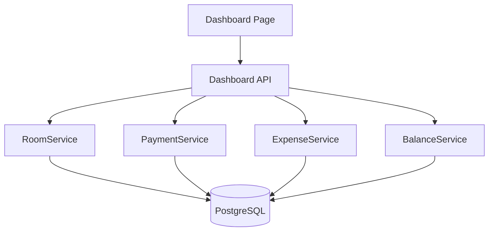
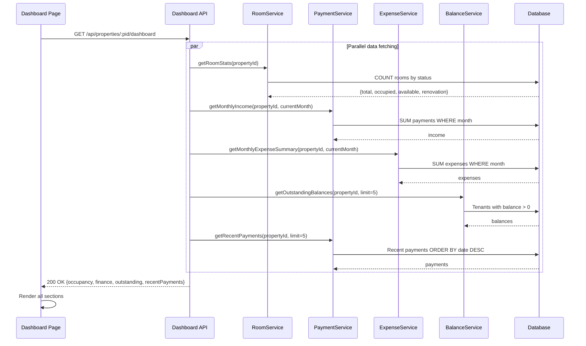

# Design: Dashboard / Overview

## Overview

The Dashboard is the landing page after login, providing a single-screen summary of the active property's key metrics: occupancy, finances, outstanding balances, and recent payments. It aggregates data from multiple services (RoomService, PaymentService, ExpenseService, BalanceService) into a read-only, glanceable, mobile-first layout.

### Key Design Decisions

**Single API Endpoint**: The dashboard uses a single aggregate API endpoint (`/api/properties/:pid/dashboard`) that fetches all four data sections in parallel on the server side. This minimizes client round trips and ensures consistent data across all sections.

**Read-Only Page**: The dashboard displays data only — all CRUD operations happen on their respective feature pages. This keeps the dashboard fast and simple.

**Top-5 Limits**: Outstanding balances and recent payments are limited to 5 entries each, with "View All" links. This keeps the page scannable on mobile without excessive scrolling.

**Current Month Only**: The finance summary always shows the current calendar month (UTC). Historical navigation is available on the dedicated Finance page.

**Skeleton Loading**: Each dashboard section has its own skeleton loader, allowing sections to render independently as their data arrives.

## Architecture

### System Context



### Data Flow



## Components and Interfaces

### 1. Dashboard Service

**Responsibility**: Aggregates data from multiple services into a single dashboard response.

**Interface**:
```typescript
interface IDashboardService {
  getDashboardData(propertyId: string): Promise<DashboardData>;
}

interface DashboardData {
  occupancy: OccupancyStats;
  finance: FinanceSummarySnapshot;
  outstandingBalances: OutstandingBalance[];
  outstandingCount: number;
  recentPayments: RecentPayment[];
}

interface OccupancyStats {
  totalRooms: number;
  occupied: number;
  available: number;
  underRenovation: number;
  occupancyRate: number; // 0-100 percentage
}

interface FinanceSummarySnapshot {
  month: number;
  year: number;
  income: number;
  expenses: number;
  netIncome: number;
}

interface OutstandingBalance {
  tenantId: string;
  tenantName: string;
  roomNumber: string;
  balance: number;
}

interface RecentPayment {
  paymentId: string;
  tenantName: string;
  amount: number;
  date: Date;
}
```

### 2. API Route

**GET /api/properties/:propertyId/dashboard**
- Returns aggregated dashboard data
- Response: 200 OK with DashboardData
- Fetches all four sections in parallel
- Property access middleware applied
- Target response time: <3 seconds

**Response Schema**:
```typescript
interface DashboardResponse {
  occupancy: {
    totalRooms: number;
    occupied: number;
    available: number;
    underRenovation: number;
    occupancyRate: number;
  };
  finance: {
    month: number;
    year: number;
    income: number;
    expenses: number;
    netIncome: number;
  };
  outstandingBalances: Array<{
    tenantId: string;
    tenantName: string;
    roomNumber: string;
    balance: number;
  }>;
  outstandingCount: number;
  recentPayments: Array<{
    paymentId: string;
    tenantName: string;
    amount: number;
    date: string;
  }>;
}
```

### 3. UI Components

**DashboardPage**
- Route: `/` (app root, within authenticated layout)
- Vertical stack of dashboard sections
- Pull-to-refresh functionality
- Skeleton loaders per section during loading
- Property name in header (via property switcher)

**OccupancyCard Component**
- Displays: total rooms, occupied, available, under renovation, occupancy rate
- Occupancy rate as large percentage number
- Room counts as labeled metrics
- Color-coded status counts using `--status-*` CSS variables + text labels
- Full-width card on mobile

**FinanceSummaryCard Component**
- Displays: income, expenses, net income for current month
- Month/year label (e.g., "March 2026")
- Three rows: income, expenses, net income
- Net income color-coded (positive/negative) with text indicator
- All amounts formatted per locale currency
- Full-width card on mobile

**OutstandingBalancesList Component**
- Lists top 5 tenants with outstanding balance
- Each row: tenant name, room number, balance amount
- Balance with color-coded indicator (red + text label)
- "View All" link when outstandingCount > 5
- Empty state: "All tenants are up to date" with positive indicator
- Tappable rows navigate to tenant detail (44x44px touch targets)

**RecentPaymentsList Component**
- Lists 5 most recent payments
- Each row: tenant name, amount, payment date
- Amount formatted per locale currency
- Date formatted per locale
- "View All" link to payments list
- Empty state: "No payments recorded yet"
- Tappable rows (44x44px touch targets)

## Data Models

The dashboard does not introduce new database models. It reads from existing models:
- **Room** (for occupancy stats)
- **Payment** (for income + recent payments)
- **Expense** (for monthly expenses)
- **Tenant + Room + Payment** (for outstanding balances)

### Aggregation Queries

**Occupancy Stats**:
```sql
SELECT 
  COUNT(*) AS total_rooms,
  COUNT(*) FILTER (WHERE status = 'occupied') AS occupied,
  COUNT(*) FILTER (WHERE status = 'available') AS available,
  COUNT(*) FILTER (WHERE status = 'under_renovation') AS under_renovation
FROM rooms
WHERE property_id = :propertyId AND deleted_at IS NULL;
```

**Monthly Income**:
```sql
SELECT COALESCE(SUM(amount), 0) AS total_income
FROM payments
WHERE property_id = :propertyId
  AND date >= :monthStart AND date < :monthEnd;
```

**Monthly Expenses**:
```sql
SELECT COALESCE(SUM(amount), 0) AS total_expenses
FROM expenses
WHERE property_id = :propertyId
  AND date >= :monthStart AND date < :monthEnd;
```

**Outstanding Balances (top 5)**:
```sql
SELECT t.id, t.name, r.room_number,
  r.monthly_rent - COALESCE(SUM(p.amount), 0) AS balance
FROM tenants t
JOIN rooms r ON t.room_id = r.id
LEFT JOIN payments p ON p.tenant_id = t.id
WHERE t.property_id = :propertyId AND t.moved_out_at IS NULL
GROUP BY t.id, t.name, r.room_number, r.monthly_rent
HAVING r.monthly_rent - COALESCE(SUM(p.amount), 0) > 0
ORDER BY balance DESC
LIMIT 5;
```

**Recent Payments**:
```sql
SELECT p.id, t.name, p.amount, p.date
FROM payments p
JOIN tenants t ON p.tenant_id = t.id
WHERE p.property_id = :propertyId
ORDER BY p.date DESC
LIMIT 5;
```

## Correctness Properties

### Property 1: Occupancy Rate Accuracy

*For any* property with N total rooms and M occupied rooms, the occupancy rate should equal (M / N) × 100, rounded to one decimal place. If N = 0, the rate should be 0.

**Validates: Requirement 1.3, 1.5**

### Property 2: Room Count Consistency

*For any* property, the sum of occupied, available, and under_renovation counts should equal the total room count.

**Validates: Requirement 1.1, 1.2**

### Property 3: Finance Summary Accuracy

*For any* property and the current month, dashboard income should match the sum of payments, expenses should match the sum of expenses, and net income should equal income minus expenses.

**Validates: Requirements 2.1, 2.2, 2.3**

### Property 4: Outstanding Balances Ordering

*For any* set of tenants with outstanding balances, the dashboard should display them sorted by balance descending (highest first), limited to 5.

**Validates: Requirement 3.3, 3.5**

### Property 5: Recent Payments Ordering

*For any* set of payments, the dashboard should display the 5 most recent sorted by date descending.

**Validates: Requirement 4.2, 4.3**

### Property 6: Data Scoping

*For any* dashboard request, all displayed data should belong exclusively to the active property. No data from other properties should appear.

**Validates: All requirements (property scoping)**

## Error Handling

### Loading Errors

**Partial Data Failure**:
- Scenario: One aggregation query fails while others succeed
- Handling: Show available sections, display error state for failed section with retry button
- UI: Per-section error handling, not whole-page failure

**Full Load Failure**:
- Scenario: Dashboard API returns 500 or network error
- Handling: Display full-page error state with retry button
- Message: "Unable to load dashboard. Please try again."

### Edge Cases

**No Rooms**: Display 0 for all occupancy stats, occupancy rate 0%
**No Payments**: Display income 0, empty recent payments list
**No Expenses**: Display expenses 0
**No Outstanding**: Display "All tenants are up to date"
**New Property**: All sections show zero/empty states with helpful guidance messages

## Testing Strategy

### Unit Tests (15-20 tests)
- Occupancy calculation: full, empty, mixed, no rooms (4-5 tests)
- Finance snapshot: with data, no data, cross-month boundary (3-4 tests)
- Outstanding balances: ordering, limit 5, all paid (3-4 tests)
- Recent payments: ordering, limit 5, empty (3-4 tests)
- Dashboard aggregation: parallel fetch, partial failure (2-3 tests)

### Property-Based Tests (6 tests)
- One per correctness property, 100+ iterations each

### Test Data Generators

```typescript
const roomStatsArbitrary = fc.record({
  occupied: fc.nat({ max: 100 }),
  available: fc.nat({ max: 100 }),
  underRenovation: fc.nat({ max: 20 }),
});

const balanceEntryArbitrary = fc.record({
  tenantName: fc.string({ minLength: 1, maxLength: 100 }),
  roomNumber: fc.string({ minLength: 1, maxLength: 50 }),
  balance: fc.float({ min: 0.01, max: 100000, noNaN: true }),
});
```

### Integration Tests (3-5 tests)
- End-to-end dashboard load with seeded data
- Dashboard reflects room status changes
- Dashboard reflects new payment recording
- Empty property dashboard

### Performance Tests
- Dashboard load time with 500 rooms, 1000 tenants, 10000 payments
- Target: <3 seconds total response time

### Mobile Testing
- Dashboard layout on 320px, 375px, 414px, 480px widths
- Section order and spacing on mobile
- Touch targets on tappable list items
- Number readability at phone scale

## Implementation Notes

### Internationalization

```json
{
  "dashboard.title": "Overview",
  "dashboard.occupancy.title": "Occupancy",
  "dashboard.occupancy.totalRooms": "Total Rooms",
  "dashboard.occupancy.occupied": "Occupied",
  "dashboard.occupancy.available": "Available",
  "dashboard.occupancy.underRenovation": "Under Renovation",
  "dashboard.occupancy.rate": "Occupancy Rate",
  "dashboard.occupancy.empty": "No rooms added yet",
  "dashboard.finance.title": "This Month",
  "dashboard.finance.income": "Income",
  "dashboard.finance.expenses": "Expenses",
  "dashboard.finance.netIncome": "Net Income",
  "dashboard.outstanding.title": "Outstanding Balances",
  "dashboard.outstanding.viewAll": "View All",
  "dashboard.outstanding.allPaid": "All tenants are up to date",
  "dashboard.recentPayments.title": "Recent Payments",
  "dashboard.recentPayments.viewAll": "View All",
  "dashboard.recentPayments.empty": "No payments recorded yet",
  "dashboard.loading": "Loading dashboard...",
  "dashboard.error": "Unable to load dashboard",
  "dashboard.retry": "Try Again"
}
```

### Performance Optimization

```typescript
async function getDashboardData(propertyId: string): Promise<DashboardData> {
  const [occupancy, finance, outstanding, recentPayments] = await Promise.all([
    roomService.getRoomStats(propertyId),
    financeSummaryService.getCurrentMonthSummary(propertyId),
    balanceService.getTopOutstandingBalances(propertyId, 5),
    paymentService.getRecentPayments(propertyId, 5),
  ]);

  return { occupancy, finance, ...outstanding, recentPayments };
}
```

### Client-Side Caching

```typescript
function useDashboard(propertyId: string) {
  return useQuery({
    queryKey: ['dashboard', propertyId],
    queryFn: () => fetchDashboard(propertyId),
    staleTime: 60000, // 1 minute
    refetchOnWindowFocus: true,
  });
}
```

## Future Enhancements

**Out of Scope for MVP**:
- Interactive charts (occupancy trend, income chart)
- Multi-property aggregate dashboard
- Customizable widget layout
- Notification center
- Quick-action buttons (record payment, add expense from dashboard)
- Auto-refresh / real-time updates
- Date range comparison
- Export dashboard as PDF/image
- Dashboard widgets for tenant notes or maintenance
