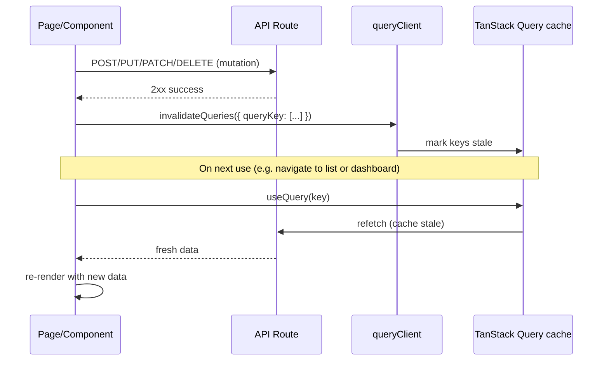

# Design: Data Freshness After Mutations

## Overview

This design addresses stale UI after mutations by ensuring every mutation invalidates the correct TanStack Query keys (and PropertyContext where used) so lists, detail views, dashboard, and balance data refetch and display updated data without a full page refresh.

## Root Cause

- Some create/edit flows use raw `fetch` + `router.push` and never call `queryClient.invalidateQueries`, so the TanStack Query cache is not invalidated.
- The dashboard query key `["dashboard", propertyId]` is never invalidated anywhere, so dashboard stats stay stale after any mutation that affects them.
- Property list uses PropertyContext `refetch()` (not TanStack Query); only Create property and Delete property call it. Delete property does not invalidate `["dashboard", propertyId]` when the deleted property was the active one.

## Key Design Decisions

**Invalidate after success only**: Call `queryClient.invalidateQueries(...)` (and optionally `ctx.refetch()` for property list) only after the mutation API returns success. Do not invalidate on error.

**Per-mutation contract**: Each mutation page/component is responsible for invalidating all query keys that are affected by that mutation. This spec and the tasks list define the contract.

**No structural change to data fetching**: Continue using TanStack Query for list/detail/dashboard and PropertyContext for property list. Only add the missing invalidation calls.

**Single source of query keys**: Dashboard uses `queryKey: ["dashboard", activeId]` (see `src/app/(app)/page.tsx`). Other keys follow existing patterns (e.g. `["rooms", propertyId]`, `["tenants", propertyId]`, `["balances", propertyId]`, `["payments", "tenant", tenantId]`, etc.). Reference existing mutation pages that already invalidate (e.g. `tenants/[tenantId]/edit/page.tsx`, `payments/new/page.tsx`, `rooms/[roomId]/page.tsx` for status, `StaffManagement.tsx`, notes components) for patterns.

## Mutation Inventory and Invalidation Contract

| # | User action | Location | API | Invalidates today | Required invalidations |
|---|-------------|----------|-----|-------------------|-------------------------|
| 1 | Create property | `app/(app)/properties/new/page.tsx` | POST /api/properties | Property list only (`ctx.refetch()`) | — (no dashboard for new property) |
| 2 | Delete property | `app/(app)/properties/page.tsx` | DELETE /api/properties/:id | Property list only | `["dashboard", propertyId]` if deleted property was active |
| 3 | Create room | `app/(app)/properties/[propertyId]/rooms/new/page.tsx` | POST .../rooms | **None** | `["rooms", propertyId]`, `["dashboard", propertyId]` |
| 4 | Edit room | `app/(app)/properties/[propertyId]/rooms/[roomId]/edit/page.tsx` | PUT .../rooms/:roomId | **None** | `["room", propertyId, roomId]`, `["rooms", propertyId]`, `["dashboard", propertyId]` |
| 5 | Change room status | `app/(app)/properties/[propertyId]/rooms/[roomId]/page.tsx` | PATCH .../rooms/:roomId/status | room, rooms | `["dashboard", propertyId]` |
| 6 | Create tenant | `app/(app)/properties/[propertyId]/tenants/new/page.tsx` | POST .../tenants | **None** | `["tenants", propertyId]`, `["balances", propertyId]`, `["dashboard", propertyId]` |
| 7 | Edit tenant | `app/(app)/properties/[propertyId]/tenants/[tenantId]/edit/page.tsx` | PUT .../tenants/:tenantId | tenant, tenants | `["dashboard", propertyId]` |
| 8 | Assign room to tenant | `app/(app)/properties/[propertyId]/tenants/[tenantId]/page.tsx` | POST .../assign-room | tenant, tenants, rooms | `["dashboard", propertyId]` |
| 9 | Move out tenant | same as 8 | POST .../move-out | tenants, rooms | `["dashboard", propertyId]`, `["balances", propertyId]`, `["tenant", ...]`, `["payments", "tenant", ...]` |
| 10 | Create payment | `app/(app)/properties/[propertyId]/payments/new/page.tsx` | POST .../payments | payments, payments by tenant | `["dashboard", propertyId]`, `["balance", propertyId, tenantId]`, `["balances", propertyId]` |
| 11 | Create expense | `app/(app)/properties/[propertyId]/finance/expenses/new/page.tsx` | POST .../expenses | expenses, finance-summary | `["dashboard", propertyId]` |
| 12 | Edit expense | `app/(app)/properties/[propertyId]/finance/expenses/[expenseId]/edit/page.tsx` | PUT .../expenses/:expenseId | expenses, finance-summary | `["dashboard", propertyId]` |
| 13 | Invite staff | `components/settings/StaffManagement.tsx` | POST .../staff | staff | — |
| 14 | Remove staff | same | DELETE .../staff/:userId | staff | — |
| 15–17 | Notes CRUD | notes-section.tsx, note-card.tsx | POST/PUT/DELETE .../notes | notes | — |

## Architecture

### Data flow: mutation then invalidation

### Where to get queryClient

- In App Router pages/components: use `useQueryClient()` from `@tanstack/react-query` (ensure the component is under `QueryClientProvider`).

### Reference implementations

- **Already correct**: `tenants/[tenantId]/edit/page.tsx`, `payments/new/page.tsx`, `rooms/[roomId]/page.tsx` (status mutation), `StaffManagement.tsx`, `notes-section.tsx` / `note-card.tsx`.
- **Dashboard query**: `src/app/(app)/page.tsx` uses `queryKey: ["dashboard", activeId]`.
- **Property list**: `src/contexts/property-context.tsx` uses custom `refetch()` (not TanStack Query); call it after create/delete property.

## Out of Scope

- Optimistic updates.
- Real-time or WebSocket-driven invalidation.
- Changing query key shapes or adding a central “invalidation registry” (future improvement).
