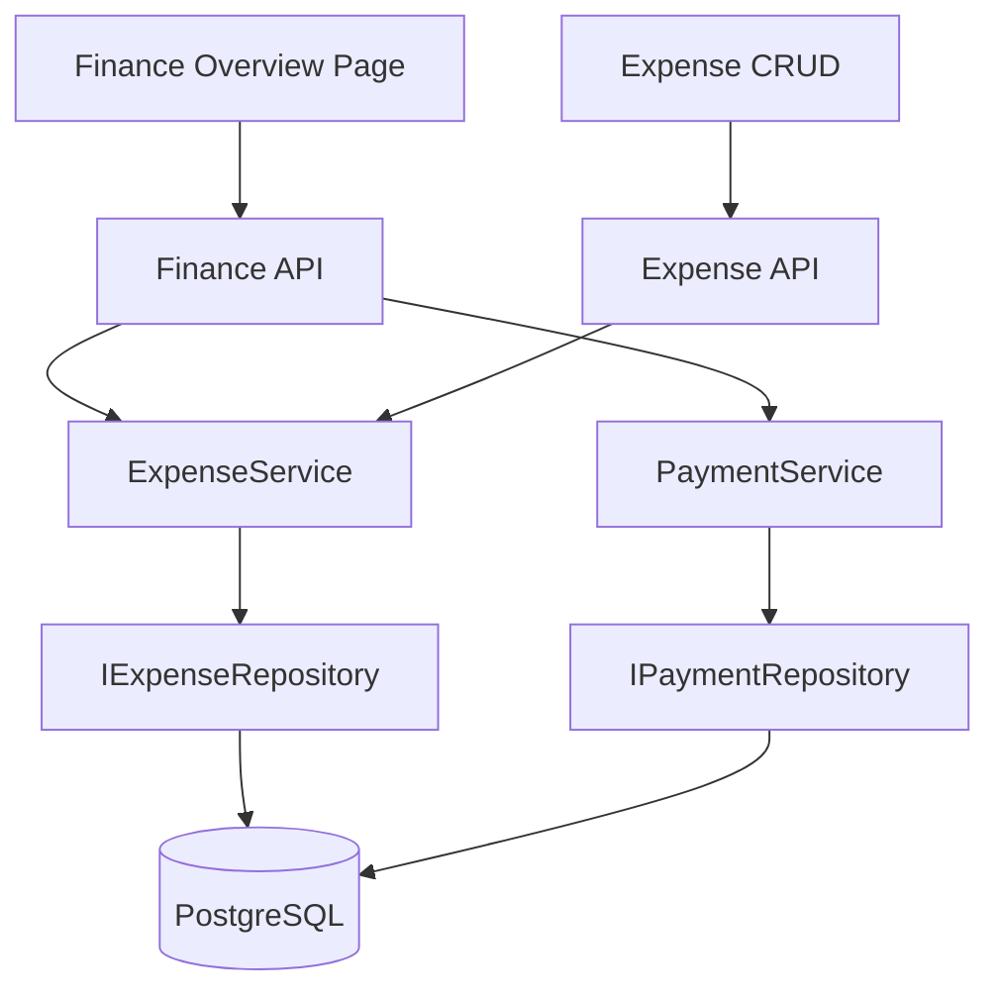
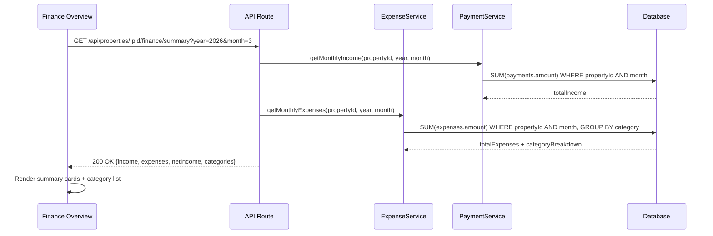
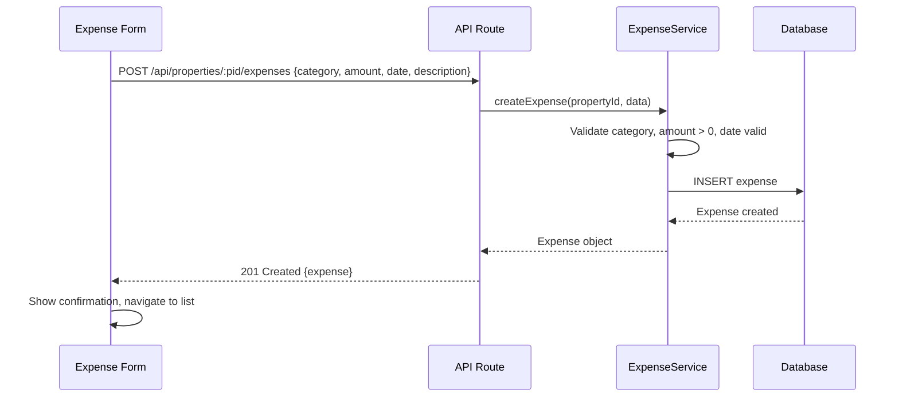

# Design: Finance & Expense Tracking

## Overview

The Finance & Expense Tracking feature provides property-level expense CRUD and a monthly finance overview that combines income (from payments) and expenses into a net income summary with category breakdown. All data is scoped per property and formatted per the active locale's currency settings.

### Key Design Decisions

**Income from Payments**: Income is not a separate entity — it is calculated by summing Payment records for the active property in the selected month. This avoids double data entry and maintains a single source of truth for income.

**Fixed Expense Categories**: Categories are a predefined enum (not user-configurable in MVP) to keep the UI simple and enable consistent reporting. The "Other" category handles anything not covered.

**Hard Delete for Expenses**: Unlike tenants (soft delete), expenses use hard delete since they can be corrected immediately and there is no audit trail requirement in MVP.

**Monthly Aggregation**: The finance overview aggregates by calendar month (UTC). The API accepts year and month parameters and returns pre-aggregated totals, reducing client-side computation.

**Category Breakdown**: Displayed as a sorted list (highest amount first), not a chart. This keeps the UI simple, accessible, and works well at small mobile viewport sizes.

## Architecture

### System Context



### Data Flow: Monthly Summary



### Data Flow: Expense Creation



## Components and Interfaces

### 1. Expense Service

**Responsibility**: Business logic for expense CRUD and monthly aggregation.

**Interface**:
```typescript
interface IExpenseService {
  createExpense(propertyId: string, data: CreateExpenseInput): Promise<Expense>;
  listExpenses(propertyId: string, filters?: ExpenseFilters): Promise<Expense[]>;
  getExpense(propertyId: string, expenseId: string): Promise<Expense>;
  updateExpense(propertyId: string, expenseId: string, data: UpdateExpenseInput): Promise<Expense>;
  deleteExpense(propertyId: string, expenseId: string): Promise<void>;
  
  getMonthlyExpenseSummary(propertyId: string, year: number, month: number): Promise<ExpenseSummary>;
}

interface CreateExpenseInput {
  category: ExpenseCategory;
  amount: number;
  date: string; // ISO date
  description?: string;
}

interface UpdateExpenseInput {
  category?: ExpenseCategory;
  amount?: number;
  date?: string;
  description?: string;
}

interface ExpenseFilters {
  year?: number;
  month?: number;
  category?: ExpenseCategory;
}

type ExpenseCategory = 
  | 'electricity' | 'water' | 'internet' | 'maintenance' 
  | 'cleaning' | 'supplies' | 'tax' | 'transfer' | 'other';

interface Expense {
  id: string;
  propertyId: string;
  category: ExpenseCategory;
  amount: number;
  date: Date;
  description: string | null;
  createdAt: Date;
  updatedAt: Date;
}

interface ExpenseSummary {
  totalExpenses: number;
  categories: CategoryBreakdown[];
}

interface CategoryBreakdown {
  category: ExpenseCategory;
  total: number;
  count: number;
}
```

### 2. Finance Summary Service

**Responsibility**: Combines income and expense data into a monthly finance summary.

**Interface**:
```typescript
interface IFinanceSummaryService {
  getMonthlySummary(propertyId: string, year: number, month: number): Promise<FinanceSummary>;
}

interface FinanceSummary {
  year: number;
  month: number;
  income: number;
  expenses: number;
  netIncome: number;
  categoryBreakdown: CategoryBreakdown[];
}
```

### 3. Expense Repository

**Interface**:
```typescript
interface IExpenseRepository {
  create(data: { propertyId: string; category: string; amount: number; date: Date; description?: string }): Promise<Expense>;
  findById(id: string): Promise<Expense | null>;
  findByProperty(propertyId: string, filters?: { year?: number; month?: number; category?: string }): Promise<Expense[]>;
  update(id: string, data: Partial<{ category: string; amount: number; date: Date; description: string }>): Promise<Expense>;
  delete(id: string): Promise<void>;
  
  sumByMonth(propertyId: string, year: number, month: number): Promise<number>;
  sumByMonthGroupedByCategory(propertyId: string, year: number, month: number): Promise<CategoryBreakdown[]>;
}
```

### 4. API Routes

**POST /api/properties/:propertyId/expenses**
- Creates a new expense for the property
- Request body: `{category, amount, date, description?}`
- Response: 201 Created with expense object
- Validation: category in enum, amount positive, date valid

**GET /api/properties/:propertyId/expenses**
- Lists expenses with optional filters
- Query params: `?year=2026&month=3&category=electricity`
- Response: 200 OK with array of expenses
- Default sort: date descending

**GET /api/properties/:propertyId/expenses/:expenseId**
- Retrieves a single expense
- Response: 200 OK or 404

**PUT /api/properties/:propertyId/expenses/:expenseId**
- Updates an expense
- Request body: `{category?, amount?, date?, description?}`
- Response: 200 OK with updated expense

**DELETE /api/properties/:propertyId/expenses/:expenseId**
- Permanently deletes an expense
- Response: 204 No Content

**GET /api/properties/:propertyId/finance/summary**
- Returns monthly finance summary (income + expenses + net + categories)
- Query params: `?year=2026&month=3`
- Response: 200 OK with FinanceSummary object
- Income calculated from Payment records
- Expenses calculated from Expense records

### 5. UI Components

**FinanceOverview Page**
- Route: `/finance`
- Month selector at top (previous/next arrows + month/year display)
- Three summary cards: Income, Expenses, Net Income
- Net income card color-coded: positive (green text + icon), negative (red text + icon), zero (neutral)
- Category breakdown list below summary cards
- Link to expense list / "Add Expense" button
- All amounts formatted via `Intl.NumberFormat`

**ExpenseList Page**
- Route: `/finance/expenses`
- Card layout showing all expenses for active property
- Each card: category icon, category label, amount, date, description preview
- Filter by month and category
- "Add Expense" floating action button
- Single-column on mobile

**ExpenseForm Component**
- Fields: category (select dropdown), amount (number input), date (date picker, defaults today), description (textarea, optional)
- Client-side validation with React Hook Form + Zod
- Mobile-optimized: single column, 44x44px touch targets
- Used for both create and edit modes

**SummaryCard Component**
- Displays label, amount, and optional indicator
- Large readable amount with locale currency formatting
- Color-coded for positive/negative/neutral
- Mobile-optimized: full-width, prominent typography

**CategoryBreakdownList Component**
- Sorted list of categories with amounts
- Category icon + label on left, amount right-aligned
- Percentage of total shown as secondary text
- Full-width on mobile

**MonthSelector Component**
- Previous/next arrow buttons (44x44px touch targets)
- Current month/year display between arrows
- Updates parent state to trigger data refresh

## Data Models

### Database Schema

```prisma
model Expense {
  id          String   @id @default(cuid())
  propertyId  String
  category    String
  amount      Decimal  @db.Decimal(12, 2)
  date        DateTime @db.Date
  description String?  @db.Text
  createdAt   DateTime @default(now())
  updatedAt   DateTime @updatedAt

  property Property @relation(fields: [propertyId], references: [id])

  @@index([propertyId])
  @@index([propertyId, date])
  @@index([category])
  @@map("expenses")
}
```

### Validation Schemas

```typescript
import { z } from 'zod';

const expenseCategories = [
  'electricity', 'water', 'internet', 'maintenance',
  'cleaning', 'supplies', 'tax', 'transfer', 'other',
] as const;

export const createExpenseSchema = z.object({
  category: z.enum(expenseCategories),
  amount: z.number().positive('Amount must be positive'),
  date: z.string().refine(val => !isNaN(Date.parse(val)), 'Invalid date'),
  description: z.string().max(1000).trim().optional(),
});

export const updateExpenseSchema = z.object({
  category: z.enum(expenseCategories).optional(),
  amount: z.number().positive('Amount must be positive').optional(),
  date: z.string().refine(val => !isNaN(Date.parse(val)), 'Invalid date').optional(),
  description: z.string().max(1000).trim().optional(),
}).refine(data => Object.keys(data).length > 0, {
  message: 'At least one field must be provided',
});

export const financeSummaryQuerySchema = z.object({
  year: z.coerce.number().int().min(2000).max(2100),
  month: z.coerce.number().int().min(1).max(12),
});
```

### Business Rules

1. Expenses are scoped to a property via `propertyId`
2. Category must be one of the predefined enum values
3. Amount must be a positive decimal
4. Description is optional, max 1,000 characters
5. Date defaults to today, must be a valid calendar date
6. Income is read from Payment records — no separate income entity
7. Net income = monthly income (sum of payments) - monthly expenses (sum of expenses)
8. Category breakdown sorted by total amount descending
9. Hard delete for expenses

## Correctness Properties

### Property 1: Expense Creation Round Trip

*For any* valid expense data (valid category, positive amount, valid date), creating an expense and listing the property's expenses should include the newly created expense with all data intact.

**Validates: Requirements 1.3, 1.6**

### Property 2: Monthly Income Calculation

*For any* set of payments for a property in a given month, the monthly income should equal the sum of all payment amounts in that month.

**Validates: Requirement 5.2**

### Property 3: Monthly Expense Calculation

*For any* set of expenses for a property in a given month, the monthly expenses total should equal the sum of all expense amounts in that month.

**Validates: Requirement 6.2**

### Property 4: Net Income Accuracy

*For any* month, net income should equal monthly income minus monthly expenses, including negative results when expenses exceed income.

**Validates: Requirement 7.1**

### Property 5: Category Breakdown Completeness

*For any* set of expenses in a month, the sum of all category totals in the breakdown should equal the total monthly expenses.

**Validates: Requirement 6.3**

### Property 6: Category Validation

*For any* expense creation or update, the category must be one of the predefined values. Any other value should be rejected with a validation error.

**Validates: Requirement 1.2**

### Property 7: Amount Validation

*For any* expense with zero or negative amount, the system should reject the operation with a validation error.

**Validates: Requirement 1.5**

### Property 8: Month Filtering Accuracy

*For any* selected month, the finance summary should include only payments and expenses whose dates fall within that calendar month.

**Validates: Requirements 5.2, 6.2, 8.2**

## Error Handling

### Validation Errors

**Invalid Category**:
- Handling: Return 400 Bad Request
- Message: "Category must be one of: Electricity, Water, Internet, Maintenance, Cleaning, Supplies, Tax, Transfer, Other"

**Invalid Amount**:
- Handling: Return 400 Bad Request
- Message: "Amount must be a positive number"

**Missing Required Fields**:
- Handling: Return 400 Bad Request with field-specific errors

### Not Found Errors

**Expense Not Found**:
- Handling: Return 404 Not Found
- UI: Show error toast, refresh list

### Authorization Errors

**No Property Access**:
- Handling: Return 403 Forbidden (via property access middleware)

### Database Errors

**Connection Failure**:
- Handling: Return 503 with retry guidance

## Testing Strategy

### Unit Tests (25-35 tests)
- Expense CRUD: valid data, missing fields, invalid amount, invalid category (6-8 tests)
- Monthly income calculation: single/multiple payments, no payments, cross-month (4-5 tests)
- Monthly expense calculation: single/multiple expenses, category grouping (4-5 tests)
- Net income: positive, negative, zero (3 tests)
- Category breakdown: multiple categories, single category, empty (3-4 tests)
- Expense filtering: by month, by category (3-4 tests)
- API routes: endpoints, validation, status codes (6-8 tests)

### Property-Based Tests (8 tests)
- One per correctness property, 100+ iterations each

### Test Data Generators

```typescript
const expenseCategoryArbitrary = fc.constantFrom(
  'electricity', 'water', 'internet', 'maintenance',
  'cleaning', 'supplies', 'tax', 'transfer', 'other'
);

const expenseDataArbitrary = fc.record({
  category: expenseCategoryArbitrary,
  amount: fc.float({ min: 0.01, max: 1000000, noNaN: true }),
  date: fc.date({ min: new Date('2020-01-01'), max: new Date('2030-12-31') })
    .map(d => d.toISOString().split('T')[0]),
  description: fc.option(fc.string({ maxLength: 1000 }), { nil: undefined }),
});
```

### Mobile Testing
- Finance overview layout on 320px-480px
- Summary card readability at phone scale
- Category breakdown list on mobile
- Month selector touch targets
- Expense form usability

## Implementation Notes

### Internationalization

```json
{
  "finance.title": "Finance",
  "finance.income": "Income",
  "finance.expenses": "Expenses",
  "finance.netIncome": "Net Income",
  "finance.noData": "No financial data for this month",
  "finance.positive": "Profit",
  "finance.negative": "Loss",
  "finance.categoryBreakdown": "Expense Breakdown",
  "expense.create.title": "Add Expense",
  "expense.edit.title": "Edit Expense",
  "expense.form.category": "Category",
  "expense.form.amount": "Amount",
  "expense.form.date": "Date",
  "expense.form.description": "Description (optional)",
  "expense.form.submit": "Save Expense",
  "expense.form.cancel": "Cancel",
  "expense.create.success": "Expense recorded",
  "expense.edit.success": "Expense updated",
  "expense.delete.confirm": "Delete this expense?",
  "expense.delete.success": "Expense deleted",
  "expense.list.title": "Expenses",
  "expense.list.empty": "No expenses recorded for this period",
  "expense.category.electricity": "Electricity",
  "expense.category.water": "Water",
  "expense.category.internet": "Internet",
  "expense.category.maintenance": "Maintenance",
  "expense.category.cleaning": "Cleaning",
  "expense.category.supplies": "Supplies",
  "expense.category.tax": "Tax",
  "expense.category.transfer": "Transfer",
  "expense.category.other": "Other",
  "expense.validation.categoryRequired": "Please select a category",
  "expense.validation.amountPositive": "Amount must be a positive number",
  "expense.validation.dateRequired": "Date is required"
}
```

### Currency Formatting

```typescript
function useFormatCurrency() {
  const { i18n } = useTranslation();
  const currencyConfig = i18n.t('currency', { returnObjects: true });
  
  return (amount: number) => new Intl.NumberFormat(currencyConfig.locale, {
    style: 'currency',
    currency: currencyConfig.code,
  }).format(amount);
}
```

## Future Enhancements

**Out of Scope for MVP**:
- User-configurable expense categories
- Receipt photo upload
- Expense CSV export
- Budget targets and alerts
- Year-over-year comparison
- Pie or bar charts for category breakdown
- Recurring expense templates
- Expense split between properties
- Integration with accounting software
- Tax reporting helpers
