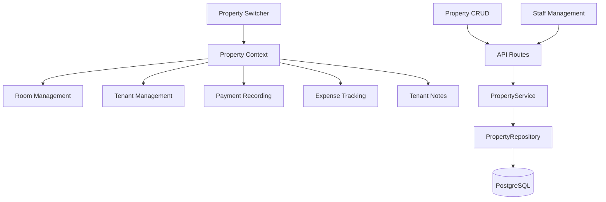
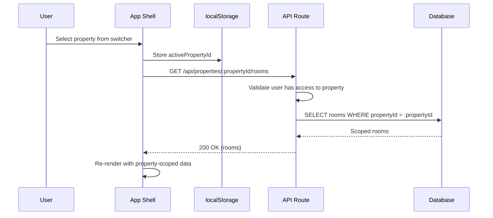
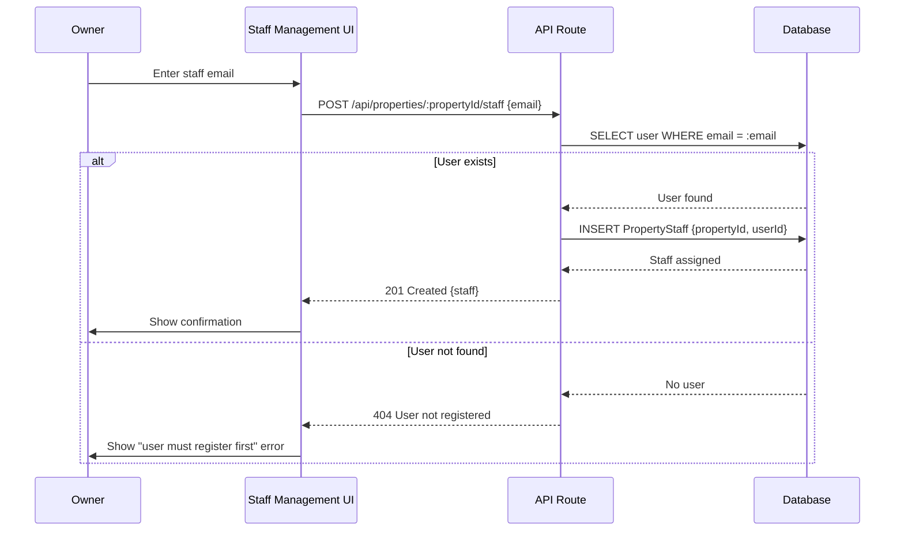

# Design: Multi-Property Management

## Overview

The Multi-Property Management feature enables property managers to create and manage multiple rental properties (kost), switch between them, and invite staff members. Every downstream entity (Room, Tenant, Payment, Expense, TenantNote) is scoped to a property via `propertyId` foreign keys, ensuring complete data isolation between properties.

### Key Design Decisions

**Property Context Pattern**: The active property is stored client-side (React state + localStorage) and passed as a URL parameter or header to all API requests. API routes extract `propertyId` from the URL path (`/api/properties/[propertyId]/...`) and validate the user's access before processing.

**Owner/Staff Authorization**: Authorization is enforced at the service layer. Owners have full CRUD on property metadata and staff management. Staff have read-only access to property metadata but full CRUD on rooms, tenants, payments, expenses, and notes within assigned properties.

**Soft Delete**: Property deletion sets a `deletedAt` timestamp. Soft-deleted properties are excluded from all queries but preserved for data integrity (cascading foreign keys remain intact).

**Property Switcher**: Displayed as a bottom sheet on mobile (for thumb reachability) and a dropdown on larger screens. The active property name is always visible in the application header.

**Staff Invitation**: MVP uses a simple "add by email" flow — the invited user must already have a registered account. Post-MVP can add email-based invitations with registration flow.

## Architecture

### System Context



### Property Context Flow



### Staff Assignment Flow



## Components and Interfaces

### 1. Property Service

**Responsibility**: Business logic for property CRUD, authorization, and staff management.

**Interface**:
```typescript
interface IPropertyService {
  createProperty(userId: string, data: CreatePropertyInput): Promise<Property>;
  getProperty(userId: string, propertyId: string): Promise<Property>;
  listProperties(userId: string): Promise<Property[]>;
  updateProperty(userId: string, propertyId: string, data: UpdatePropertyInput): Promise<Property>;
  deleteProperty(userId: string, propertyId: string): Promise<void>;
  
  addStaff(ownerId: string, propertyId: string, staffEmail: string): Promise<PropertyStaff>;
  removeStaff(ownerId: string, propertyId: string, staffUserId: string): Promise<void>;
  listStaff(userId: string, propertyId: string): Promise<PropertyStaff[]>;
  
  validateAccess(userId: string, propertyId: string): Promise<PropertyRole>;
}

interface CreatePropertyInput {
  name: string;
  address: string;
}

interface UpdatePropertyInput {
  name?: string;
  address?: string;
}

type PropertyRole = 'owner' | 'staff';

interface Property {
  id: string;
  name: string;
  address: string;
  ownerId: string;
  createdAt: Date;
  updatedAt: Date;
  deletedAt: Date | null;
}

interface PropertyStaff {
  id: string;
  propertyId: string;
  userId: string;
  user: { id: string; name: string; email: string };
  assignedAt: Date;
}
```

### 2. Property Repository

**Responsibility**: Data access for property and staff records.

**Interface**:
```typescript
interface IPropertyRepository {
  create(data: { name: string; address: string; ownerId: string }): Promise<Property>;
  findById(id: string): Promise<Property | null>;
  findByUser(userId: string): Promise<Property[]>;
  update(id: string, data: Partial<{ name: string; address: string }>): Promise<Property>;
  softDelete(id: string): Promise<void>;
  
  addStaff(propertyId: string, userId: string): Promise<PropertyStaff>;
  removeStaff(propertyId: string, userId: string): Promise<void>;
  findStaff(propertyId: string): Promise<PropertyStaff[]>;
  findUserRole(propertyId: string, userId: string): Promise<PropertyRole | null>;
}
```

### 3. API Routes

**POST /api/properties**
- Creates a new property for the authenticated user
- Request body: `{name, address}`
- Response: 201 Created with property object
- Validation: name required (1-200 chars), address required (1-500 chars)

**GET /api/properties**
- Lists all properties where user is owner or staff
- Response: 200 OK with array of properties including user's role
- Excludes soft-deleted properties

**GET /api/properties/:propertyId**
- Retrieves a single property by ID
- Response: 200 OK with property + role, or 403/404
- Validates user access

**PUT /api/properties/:propertyId**
- Updates property information (owner only)
- Request body: `{name?, address?}`
- Response: 200 OK with updated property
- Returns 403 if user is not owner

**DELETE /api/properties/:propertyId**
- Soft-deletes property (owner only)
- Response: 204 No Content
- Returns 403 if user is not owner

**POST /api/properties/:propertyId/staff**
- Adds staff member by email (owner only)
- Request body: `{email}`
- Response: 201 Created with staff record
- Returns 404 if email not registered, 403 if not owner, 409 if already staff

**GET /api/properties/:propertyId/staff**
- Lists staff members for a property
- Response: 200 OK with array of staff (name, email, assignedAt)

**DELETE /api/properties/:propertyId/staff/:userId**
- Removes staff member (owner only)
- Response: 204 No Content
- Returns 403 if not owner

### 4. Property Access Middleware

**Responsibility**: Validates that the authenticated user has access to the requested property. Applied to all property-scoped routes.

```typescript
async function validatePropertyAccess(
  userId: string,
  propertyId: string,
  requiredRole?: 'owner'
): Promise<PropertyRole> {
  const role = await propertyRepository.findUserRole(propertyId, userId);
  if (!role) throw new ForbiddenError('No access to this property');
  if (requiredRole === 'owner' && role !== 'owner') {
    throw new ForbiddenError('Owner access required');
  }
  return role;
}
```

### 5. UI Components

**PropertyForm Component**
- Form with fields: name (text), address (textarea)
- Client-side validation with Zod
- Mobile-optimized: single column, 44x44px touch targets
- Used for both create and edit (mode prop)

**PropertyList Component**
- Displays all accessible properties in card layout
- Each card shows: name, address, role badge (owner/staff)
- Single-column on mobile, full-width cards
- Tap to select and set as active property

**PropertySwitcher Component**
- Positioned in app header, shows active property name
- Tap opens bottom sheet (mobile) or dropdown (desktop)
- Lists all properties with role indicator
- Selecting a property updates context and refreshes data
- Disabled visual state when only one property

**StaffManagement Component**
- Section within property settings
- Shows list of current staff (name, email, remove button)
- "Add staff" form with email input
- Owner-only: hidden for staff role
- Confirmation dialog for staff removal

**PropertyDetail Component**
- Shows property name, address, owner info
- Edit/Delete buttons visible only for owners
- Staff list section
- Mobile-optimized layout

## Data Models

### Database Schema

```prisma
model Property {
  id        String    @id @default(cuid())
  name      String
  address   String
  ownerId   String
  createdAt DateTime  @default(now())
  updatedAt DateTime  @updatedAt
  deletedAt DateTime?

  owner     User      @relation("PropertyOwner", fields: [ownerId], references: [id])
  staff     PropertyStaff[]
  rooms     Room[]
  tenants   Tenant[]
  payments  Payment[]
  expenses  Expense[]

  @@index([ownerId])
  @@map("properties")
}

model PropertyStaff {
  id         String   @id @default(cuid())
  propertyId String
  userId     String
  assignedAt DateTime @default(now())

  property Property @relation(fields: [propertyId], references: [id])
  user     User     @relation(fields: [userId], references: [id])

  @@unique([propertyId, userId])
  @@index([userId])
  @@map("property_staff")
}
```

### Validation Schemas

```typescript
import { z } from 'zod';

export const createPropertySchema = z.object({
  name: z.string().min(1, 'Property name is required').max(200).trim(),
  address: z.string().min(1, 'Address is required').max(500).trim(),
});

export const updatePropertySchema = z.object({
  name: z.string().min(1).max(200).trim().optional(),
  address: z.string().min(1).max(500).trim().optional(),
}).refine(data => Object.keys(data).length > 0, {
  message: 'At least one field must be provided',
});

export const addStaffSchema = z.object({
  email: z.string().email('Invalid email address'),
});
```

### Business Rules

**Property Creation**:
1. Authenticated user becomes the owner
2. Name and address are required
3. UUID auto-generated, immutable
4. Timestamps in UTC

**Property Deletion**:
1. Owner-only operation
2. Soft delete (set `deletedAt`)
3. Excluded from all queries after deletion
4. Associated data preserved for integrity

**Staff Management**:
1. Owner-only: add/remove staff
2. Staff must have an existing registered account
3. A user cannot be added as staff to the same property twice
4. Removing staff revokes access immediately
5. Owner cannot remove themselves

**Data Scoping**:
1. All rooms, tenants, payments, expenses, notes require a `propertyId`
2. API routes validate user access before returning data
3. Creating records automatically inherits active `propertyId`
4. No cross-property data access allowed

## Correctness Properties

### Property 1: Property Creation Sets Owner

*For any* valid property data and authenticated user, creating a property should return a property object with the creating user set as owner, a unique ID, and UTC timestamps.

**Validates: Requirement 1.4**

### Property 2: Property List Completeness

*For any* user, listing properties should return exactly the set of properties where the user is owner OR assigned as staff, excluding soft-deleted properties.

**Validates: Requirements 2.1, 4.4**

### Property 3: Owner-Only Modification

*For any* property update or delete attempt by a non-owner user, the system should reject the operation with a 403 Forbidden error.

**Validates: Requirements 3.5, 4.6**

### Property 4: Staff Uniqueness

*For any* property and user combination, adding staff should succeed only if the user is not already staff on that property. Duplicate additions should return a 409 Conflict.

**Validates: Requirement 6.3**

### Property 5: Data Isolation

*For any* two properties P1 and P2, data created under P1 should never appear in queries scoped to P2, regardless of the user's access to both.

**Validates: Requirement 7.2**

### Property 6: Access Validation

*For any* API request targeting a property, the system should verify the authenticated user is owner or staff of that property before processing. Unauthorized access returns 403.

**Validates: Requirement 7.5**

### Property 7: Soft Delete Exclusion

*For any* soft-deleted property, subsequent list and access queries should exclude it from results.

**Validates: Requirements 4.3, 4.4**

### Property 8: Staff Removal Revokes Access

*For any* removed staff member, subsequent API requests to that property should return 403 Forbidden.

**Validates: Requirement 6.6**

## Error Handling

### Validation Errors

**Missing Required Fields**:
- Scenario: Property creation with empty name or address
- Handling: Return 400 Bad Request with field-specific errors
- UI: Display inline error messages below each invalid field

**Name Too Long**:
- Scenario: Property name exceeds 200 characters
- Handling: Return 400 Bad Request
- Message: "Property name must be 200 characters or fewer"

### Authorization Errors

**Staff Attempts Owner Action**:
- Scenario: Staff member tries to edit/delete property or manage staff
- Handling: Return 403 Forbidden
- UI: Edit/delete buttons hidden for staff; API returns 403 as defense-in-depth

**No Property Access**:
- Scenario: User tries to access a property they're not owner/staff of
- Handling: Return 403 Forbidden
- UI: Redirect to property list

### Business Rule Violations

**Duplicate Staff**:
- Scenario: Owner adds a user already assigned as staff
- Handling: Return 409 Conflict
- Message: "This user is already staff on this property"

**Unregistered Staff Email**:
- Scenario: Owner invites an email that has no registered account
- Handling: Return 404 Not Found
- Message: "No registered account found for this email. The user must register first."

**Owner Self-Removal**:
- Scenario: Owner tries to remove themselves from staff
- Handling: Return 400 Bad Request
- Message: "Cannot remove the property owner"

**Delete Last Property**:
- Scenario: Owner deletes their only property
- Handling: Allow deletion, show "create property" prompt
- UI: Redirect to property creation page

### Database Errors

**Connection Failure**:
- Handling: Return 503 Service Unavailable with retry guidance
- UI: Display "Service temporarily unavailable" with retry button

## Testing Strategy

### Unit Tests (25-35 tests)
- Property creation: valid data, missing fields, owner assignment (5-7 tests)
- Property retrieval: list owned, list as staff, exclude deleted (4-6 tests)
- Property update: valid updates, owner-only enforcement (4-5 tests)
- Property deletion: soft delete, owner-only, active property switch (4-5 tests)
- Staff management: add, remove, duplicate, unregistered email (5-7 tests)
- Access validation: owner, staff, unauthorized (3-5 tests)

### Property-Based Tests (8 tests)
- One test per correctness property
- Each runs 100+ iterations
- Generators for property data, user roles, staff assignments

### Test Data Generators

```typescript
const propertyDataArbitrary = fc.record({
  name: fc.string({ minLength: 1, maxLength: 200 }).filter(s => s.trim().length > 0),
  address: fc.string({ minLength: 1, maxLength: 500 }).filter(s => s.trim().length > 0),
});

const propertyRoleArbitrary = fc.constantFrom('owner', 'staff');
```

### Integration Tests (5-8 tests)
- End-to-end property creation and selection
- Property switching scopes data correctly
- Staff assignment and access validation
- Soft delete and data preservation
- Cross-property data isolation

### Mobile Testing
- Property switcher bottom sheet on 320px-480px widths
- Touch targets on property list cards
- Form layout and validation on mobile
- Staff management section on mobile

## Implementation Notes

### Active Property Storage

```typescript
const ACTIVE_PROPERTY_KEY = 'ekost_active_property_id';

export function useActiveProperty() {
  const [activePropertyId, setActivePropertyId] = useState<string | null>(
    () => localStorage.getItem(ACTIVE_PROPERTY_KEY)
  );

  const setActiveProperty = (propertyId: string) => {
    localStorage.setItem(ACTIVE_PROPERTY_KEY, propertyId);
    setActivePropertyId(propertyId);
  };

  return { activePropertyId, setActiveProperty };
}
```

### Property-Scoped API Client

All API calls for downstream features use the active property context:

```typescript
function usePropertyApi() {
  const { activePropertyId } = useActiveProperty();
  
  const basePath = `/api/properties/${activePropertyId}`;
  
  return {
    rooms: `${basePath}/rooms`,
    tenants: `${basePath}/tenants`,
    payments: `${basePath}/payments`,
    expenses: `${basePath}/expenses`,
  };
}
```

### Internationalization

**Translation Keys**:
```json
{
  "property.create.title": "Add Property",
  "property.create.name": "Property Name",
  "property.create.address": "Address",
  "property.create.submit": "Create Property",
  "property.create.success": "Property created successfully",
  "property.edit.title": "Edit Property",
  "property.edit.submit": "Save Changes",
  "property.edit.success": "Property updated successfully",
  "property.delete.confirm": "Are you sure you want to delete this property? All associated data will be archived.",
  "property.delete.success": "Property deleted successfully",
  "property.list.title": "My Properties",
  "property.list.empty": "No properties yet. Create your first property to get started.",
  "property.switcher.title": "Switch Property",
  "property.role.owner": "Owner",
  "property.role.staff": "Staff",
  "property.staff.title": "Staff Members",
  "property.staff.add": "Add Staff",
  "property.staff.email": "Staff Email Address",
  "property.staff.addSubmit": "Invite",
  "property.staff.addSuccess": "Staff member added successfully",
  "property.staff.remove": "Remove",
  "property.staff.removeConfirm": "Remove this staff member's access to this property?",
  "property.staff.removeSuccess": "Staff member removed",
  "property.staff.empty": "No staff assigned to this property.",
  "property.validation.nameRequired": "Property name is required",
  "property.validation.addressRequired": "Address is required",
  "property.errors.notFound": "Property not found",
  "property.errors.forbidden": "You do not have access to this property",
  "property.errors.staffNotRegistered": "No registered account found for this email",
  "property.errors.staffAlreadyAssigned": "This user is already staff on this property"
}
```

## Future Enhancements

**Out of Scope for MVP**:
- Property photo/image upload
- Property-level settings (custom categories, rent schedules)
- Email-based staff invitation with registration link
- Transfer property ownership
- Property archive/restore UI
- Bulk staff import
- Property duplication/templating
- Property-level dashboard customization
