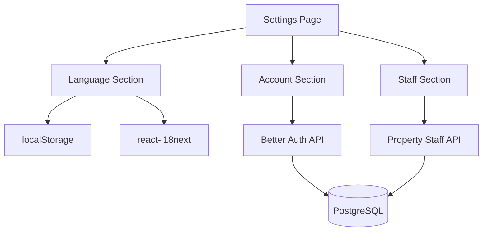
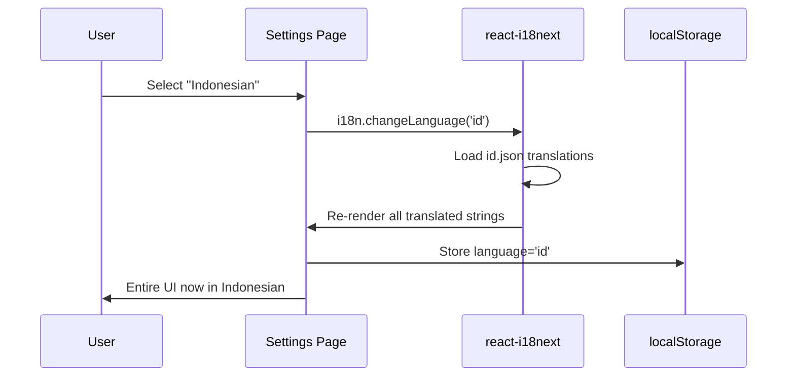
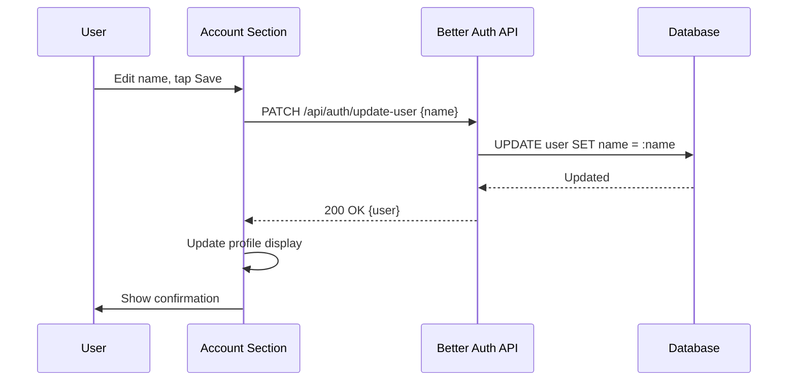

# Design: Settings & Staff Management

## Overview

The Settings feature provides a unified page with three sections: Language Selection, Account Settings, and Staff Management (for property owners). It is the final feature in the MVP, building on top of all previously implemented features (auth, multi-property, i18n infrastructure).

### Key Design Decisions

**Single Settings Page**: All settings are on one page with clear section separators rather than a nested settings hierarchy. This reduces navigation depth on mobile.

**Client-Side Language Persistence**: Language preference is stored in localStorage and applied at app initialization via react-i18next. No server-side language storage is needed — the same user can use different languages on different devices.

**Reuse Staff APIs**: Staff management on the settings page uses the same APIs built in Multi-Property Management (Phase 2). The settings page simply provides an alternative UI entry point to manage staff for the active property.

**Limited Account Editing**: MVP only allows editing the user's name (not email, not password). Email changes require verification; password changes require a reset flow. Both are post-MVP.

**Owner-Only Staff Section**: The staff management section renders conditionally based on the user's role for the active property. Staff members see Language and Account sections only.

## Architecture

### System Context



### Language Switch Flow



### Account Update Flow



## Components and Interfaces

### 1. API Routes

**Better Auth Profile Update** (built-in):
- Better Auth provides `authClient.updateUser({ name })` via its React client
- No custom API route needed — uses Better Auth's built-in endpoint

**Staff Management APIs** (from Phase 2):
- GET /api/properties/:propertyId/staff
- POST /api/properties/:propertyId/staff
- DELETE /api/properties/:propertyId/staff/:userId
- No new API routes needed for settings

### 2. UI Components

**SettingsPage**
- Route: `/settings`
- Single-column layout with section separators
- Sections rendered in order: Language, Account, Staff (if owner)
- Staff section conditionally rendered based on active property role
- Loading state for account and staff data
- All text via translation keys

**LanguageSelector Component**
- Displays current language with visual indicator (check mark or radio)
- Two options: English, Indonesian
- Tap to switch immediately (no save button needed)
- Persists to localStorage
- Triggers react-i18next language change
- 44x44px touch targets per option

**AccountSection Component**
- Displays: profile icon (initials), name, email (read-only)
- "Edit" button to toggle name editing mode
- Inline name edit with save/cancel buttons
- Validation: name required, non-empty
- Loading state during save
- Confirmation toast on successful update
- 44x44px touch targets

**StaffSection Component**
- Reuses StaffManagement component from Multi-Property feature
- Shows staff list + add form for the active property
- Only rendered when user role is 'owner'
- Section header: "Staff for [Property Name]"
- All functionality delegated to existing StaffManagement component

### 3. Settings Navigation

**SettingsNavItem**
- Gear icon + "Settings" label in bottom navigation
- Active state highlighting when on /settings route
- 44x44px touch target
- Translated label

## Data Models

No new database models. Settings uses:
- **User** (via Better Auth) for account info
- **PropertyStaff** (from Multi-Property) for staff management
- **localStorage** for language preference

### Language Preference Storage

```typescript
const LANGUAGE_KEY = 'ekost_language';

function getPersistedLanguage(): string {
  return localStorage.getItem(LANGUAGE_KEY) ?? 'en';
}

function persistLanguage(lang: string): void {
  localStorage.setItem(LANGUAGE_KEY, lang);
}
```

### Validation Schemas

```typescript
import { z } from 'zod';

export const updateAccountSchema = z.object({
  name: z.string().min(1, 'Name is required').max(100).trim(),
});
```

## Correctness Properties

### Property 1: Language Switch Completeness

*For any* language switch action, all visible UI text should update to the selected language. No hardcoded strings should remain in the previous language.

**Validates: Requirement 1.2**

### Property 2: Language Persistence

*For any* language selection, closing and reopening the application should load the UI in the last selected language.

**Validates: Requirements 1.3, 1.4**

### Property 3: Account Name Update Round Trip

*For any* valid name update, saving the name and refreshing the page should display the updated name in both the account section and the profile icon.

**Validates: Requirement 2.4**

### Property 4: Staff Section Visibility

*For any* user viewing the settings page, the staff section should be visible if and only if the user's role for the active property is 'owner'.

**Validates: Requirements 3.1, 3.6**

### Property 5: Locale Formatting Consistency

*For any* language switch, all date, number, and currency formatting throughout the application should update to match the selected locale's conventions.

**Validates: Requirement 1.6**

## Error Handling

### Account Errors

**Empty Name**:
- Handling: Client-side validation prevents submission
- Message: "Name is required"
- UI: Inline error below name field

**Update Failed**:
- Handling: Display error toast
- Message: "Failed to update account. Please try again."
- UI: Keep form in edit mode for retry

### Staff Errors

Handled by existing StaffManagement component (from Multi-Property):
- Unregistered email: "No registered account found for this email"
- Duplicate staff: "This user is already staff on this property"
- Network error: retry guidance

### Language Errors

**Locale File Load Failure**:
- Handling: Fall back to English
- UI: Display content in English, log error

## Testing Strategy

### Unit Tests (12-18 tests)
- Language switch: both directions, persistence, formatting update (4-5 tests)
- Account display: name, email, profile icon (3-4 tests)
- Account update: valid name, empty name, API error (3-4 tests)
- Staff section visibility: owner vs staff role (2-3 tests)
- Settings page layout: section ordering, separators (2-3 tests)

### Property-Based Tests (5 tests)
- One per correctness property, 100+ iterations each

### Test Data Generators

```typescript
const nameArbitrary = fc.string({ minLength: 1, maxLength: 100 }).filter(s => s.trim().length > 0);
const languageArbitrary = fc.constantFrom('en', 'id');
```

### Integration Tests (3-5 tests)
- End-to-end language switch (select → all UI updates → persist → reload → preserved)
- End-to-end name update (edit → save → profile icon updates)
- Staff section visibility based on property role
- Settings accessible from bottom navigation

### Mobile Testing
- Settings page layout on 320px-480px
- Language selector touch targets
- Account edit form on mobile
- Staff section on mobile
- Section separator visibility

## Implementation Notes

### i18n Integration

```typescript
import { useTranslation } from 'react-i18next';

function LanguageSelector() {
  const { i18n, t } = useTranslation();
  
  const handleLanguageChange = (lang: string) => {
    i18n.changeLanguage(lang);
    persistLanguage(lang);
  };
  
  return (
    <div>
      <h3>{t('settings.language.title')}</h3>
      <button 
        onClick={() => handleLanguageChange('en')}
        aria-pressed={i18n.language === 'en'}
      >
        English {i18n.language === 'en' && '✓'}
      </button>
      <button 
        onClick={() => handleLanguageChange('id')}
        aria-pressed={i18n.language === 'id'}
      >
        Bahasa Indonesia {i18n.language === 'id' && '✓'}
      </button>
    </div>
  );
}
```

### Account Update with Better Auth

```typescript
import { authClient } from '@/lib/auth-client';

async function updateName(name: string) {
  const { error } = await authClient.updateUser({ name });
  if (error) throw error;
}
```

### Internationalization

```json
{
  "settings.title": "Settings",
  "settings.language.title": "Language",
  "settings.language.english": "English",
  "settings.language.indonesian": "Bahasa Indonesia",
  "settings.language.current": "Current language",
  "settings.account.title": "Account",
  "settings.account.name": "Name",
  "settings.account.email": "Email",
  "settings.account.emailReadOnly": "Email cannot be changed",
  "settings.account.edit": "Edit",
  "settings.account.save": "Save",
  "settings.account.cancel": "Cancel",
  "settings.account.updateSuccess": "Account updated",
  "settings.account.updateError": "Failed to update account",
  "settings.staff.title": "Staff for {{propertyName}}",
  "settings.validation.nameRequired": "Name is required"
}
```

## Future Enhancements

**Out of Scope for MVP**:
- Password change
- Email change (with verification)
- Account deletion
- Push notification preferences
- Dark mode / theme settings
- Currency preference per user (currently locale-level)
- Additional language support beyond en/id
- Profile photo upload
- Advanced role/permission configuration
- Data export settings
- Session management (view/revoke active sessions)
