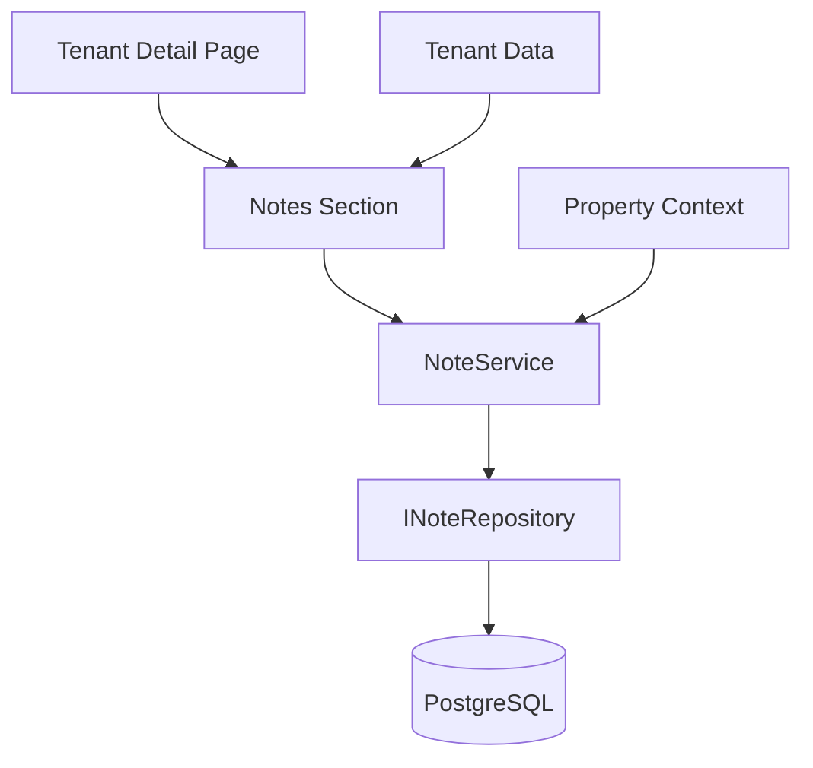
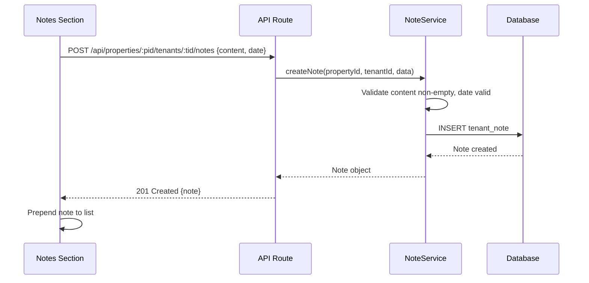
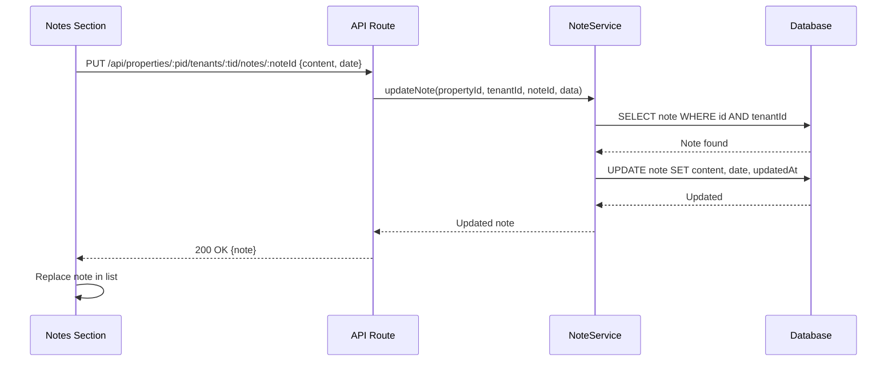

# Design: Tenant Notes

## Overview

The Tenant Notes feature adds a per-tenant CRUD notes system embedded within the tenant detail page. Notes are free-text entries with dates, displayed in reverse chronological order, and scoped to a tenant within a property. This is a lightweight feature building on top of existing tenant and property infrastructure.

### Key Design Decisions

**Embedded UI**: Notes are displayed as a section within the tenant detail page, not a separate page. This keeps the tenant context visible and reduces navigation on mobile.

**Hard Delete**: Unlike tenants (soft delete), notes use hard delete since they are informal operational records, not financial data requiring audit trails.

**Inline Editing**: Note editing uses an inline form that replaces the note card content, avoiding full-page navigation for a quick edit.

**Date Field**: Each note has a user-specified date (defaults to today) separate from the system `createdAt` timestamp. The date represents when the observation/event occurred, while `createdAt` records when the note was entered.

**Content Limit**: 2,000 characters per note — enough for a detailed observation but prevents misuse as a document storage system.

## Architecture

### System Context



### Data Flow: Create Note



### Data Flow: Update Note



## Components and Interfaces

### 1. Note Service

**Responsibility**: Business logic for note CRUD operations.

**Interface**:
```typescript
interface INoteService {
  createNote(propertyId: string, tenantId: string, data: CreateNoteInput): Promise<TenantNote>;
  listNotes(propertyId: string, tenantId: string): Promise<TenantNote[]>;
  updateNote(propertyId: string, tenantId: string, noteId: string, data: UpdateNoteInput): Promise<TenantNote>;
  deleteNote(propertyId: string, tenantId: string, noteId: string): Promise<void>;
}

interface CreateNoteInput {
  content: string;
  date: string; // ISO date string (YYYY-MM-DD)
}

interface UpdateNoteInput {
  content?: string;
  date?: string;
}

interface TenantNote {
  id: string;
  tenantId: string;
  content: string;
  date: Date;
  createdAt: Date;
  updatedAt: Date;
}
```

### 2. Note Repository

**Interface**:
```typescript
interface INoteRepository {
  create(data: { tenantId: string; content: string; date: Date }): Promise<TenantNote>;
  findByTenant(tenantId: string): Promise<TenantNote[]>;
  findById(id: string): Promise<TenantNote | null>;
  update(id: string, data: Partial<{ content: string; date: Date }>): Promise<TenantNote>;
  delete(id: string): Promise<void>;
}
```

### 3. API Routes

**POST /api/properties/:propertyId/tenants/:tenantId/notes**
- Creates a new note for the tenant
- Request body: `{content, date}`
- Response: 201 Created with note object
- Validation: content required (1-2000 chars), date required (valid date)
- Access: property owner or staff

**GET /api/properties/:propertyId/tenants/:tenantId/notes**
- Lists all notes for a tenant, sorted by date descending
- Response: 200 OK with array of notes
- Access: property owner or staff

**PUT /api/properties/:propertyId/tenants/:tenantId/notes/:noteId**
- Updates a note's content and/or date
- Request body: `{content?, date?}`
- Response: 200 OK with updated note
- Validation: content non-empty if provided, date valid if provided

**DELETE /api/properties/:propertyId/tenants/:tenantId/notes/:noteId**
- Permanently deletes a note
- Response: 204 No Content
- Access: property owner or staff

### 4. UI Components

**NotesSection Component**
- Embedded within tenant detail page
- Shows note list and "Add Note" button
- Handles loading, empty, and error states
- Disabled new note creation for moved-out tenants

**NoteCard Component**
- Displays single note: content, date, edit/delete icons
- Full-width card on mobile with adequate padding
- Edit/delete icons as 44x44px touch targets
- Truncates very long content with "show more" if needed

**NoteForm Component**
- Used for both create and inline edit
- Fields: content (textarea, auto-expanding), date (date picker, defaults to today)
- Client-side validation with React Hook Form + Zod
- Submit and cancel buttons with 44x44px touch targets

**DeleteConfirmation Component**
- Reuses shared confirmation dialog
- Shows "Delete this note?" with confirm/cancel buttons
- 44x44px touch targets

## Data Models

### Database Schema

```prisma
model TenantNote {
  id        String   @id @default(cuid())
  tenantId  String
  content   String   @db.Text
  date      DateTime @db.Date
  createdAt DateTime @default(now())
  updatedAt DateTime @updatedAt

  tenant Tenant @relation(fields: [tenantId], references: [id])

  @@index([tenantId])
  @@map("tenant_notes")
}
```

### Validation Schemas

```typescript
import { z } from 'zod';

export const createNoteSchema = z.object({
  content: z.string().min(1, 'Note content is required').max(2000, 'Note must be 2000 characters or fewer').trim(),
  date: z.string().refine(val => !isNaN(Date.parse(val)), 'Invalid date'),
});

export const updateNoteSchema = z.object({
  content: z.string().min(1).max(2000).trim().optional(),
  date: z.string().refine(val => !isNaN(Date.parse(val)), 'Invalid date').optional(),
}).refine(data => Object.keys(data).length > 0, {
  message: 'At least one field must be provided',
});
```

### Business Rules

1. Notes are scoped to a tenant within a property
2. Content is required, 1-2000 characters
3. Date defaults to today, must be a valid calendar date
4. Notes sorted by date descending in display
5. Hard delete (no soft delete for notes)
6. Notes preserved when tenant is soft-deleted (moved out)
7. No new notes can be created for moved-out tenants
8. Note ownership is inherited from tenant → property → user access

## Correctness Properties

### Property 1: Note Creation Round Trip

*For any* valid note data (non-empty content, valid date), creating a note and listing the tenant's notes should include the newly created note with all original data intact.

**Validates: Requirements 1.3, 1.5**

### Property 2: Note List Ordering

*For any* collection of notes for a tenant, listing notes should return them sorted by date in descending order.

**Validates: Requirement 2.3**

### Property 3: Note Update Preserves Identity

*For any* note update, the note's unique ID and creation timestamp should remain unchanged while content and date are updated.

**Validates: Requirement 3.4**

### Property 4: Note Deletion Removes Completely

*For any* deleted note, subsequent list requests for that tenant should not include the deleted note.

**Validates: Requirement 4.3, 4.4**

### Property 5: Content Validation

*For any* note creation or update with empty content (after trimming), the system should reject the operation with a validation error.

**Validates: Requirements 1.4, 3.5**

### Property 6: Moved-Out Tenant Note Preservation

*For any* tenant with notes who is moved out, listing their notes should still return all previously created notes.

**Validates: Requirement 5.1**

## Error Handling

### Validation Errors

**Empty Content**:
- Handling: Return 400 Bad Request
- Message: "Note content is required"
- UI: Inline error below textarea

**Content Too Long**:
- Handling: Return 400 Bad Request
- Message: "Note must be 2000 characters or fewer"
- UI: Character counter + inline error

**Invalid Date**:
- Handling: Return 400 Bad Request
- Message: "Please enter a valid date"
- UI: Inline error below date field

### Not Found Errors

**Tenant Not Found**:
- Handling: Return 404 Not Found
- UI: Redirect to tenant list

**Note Not Found**:
- Handling: Return 404 Not Found
- UI: Remove stale note from list, show error toast

### Authorization Errors

**No Property Access**:
- Handling: Return 403 Forbidden (via property access middleware)

## Testing Strategy

### Unit Tests (15-20 tests)
- Note creation: valid data, empty content, long content, default date (4-5 tests)
- Note listing: ordering, empty list, multiple notes (3-4 tests)
- Note update: valid update, empty content, preserve identity (3-4 tests)
- Note deletion: successful delete, not found (2-3 tests)
- Moved-out tenant: notes preserved, creation blocked (2-3 tests)

### Property-Based Tests (6 tests)
- One per correctness property, 100+ iterations each

### Test Data Generators

```typescript
const noteDataArbitrary = fc.record({
  content: fc.string({ minLength: 1, maxLength: 2000 }).filter(s => s.trim().length > 0),
  date: fc.date({ min: new Date('2020-01-01'), max: new Date('2030-12-31') })
    .map(d => d.toISOString().split('T')[0]),
});
```

### Mobile Testing
- Notes section layout on 320px-480px
- Touch targets for edit/delete icons
- Textarea usability on mobile keyboard
- Note card readability

## Implementation Notes

### Internationalization

```json
{
  "notes.title": "Notes",
  "notes.add": "Add Note",
  "notes.empty": "No notes yet. Add a note to record observations or agreements.",
  "notes.form.content": "Note",
  "notes.form.contentPlaceholder": "Write a note about this tenant...",
  "notes.form.date": "Date",
  "notes.form.submit": "Save Note",
  "notes.form.cancel": "Cancel",
  "notes.edit.title": "Edit Note",
  "notes.edit.success": "Note updated",
  "notes.create.success": "Note added",
  "notes.delete.confirm": "Delete this note?",
  "notes.delete.success": "Note deleted",
  "notes.validation.contentRequired": "Note content is required",
  "notes.validation.contentTooLong": "Note must be 2000 characters or fewer",
  "notes.validation.invalidDate": "Please enter a valid date",
  "notes.movedOut": "This tenant has moved out. Notes are read-only."
}
```

## Future Enhancements

**Out of Scope for MVP**:
- Note categories or tags
- Rich text or markdown formatting
- File/image attachments
- Note search across tenants
- Note pinning or starring
- Note templates
- Note activity log (who created/edited)
- Mention system (@staff)
