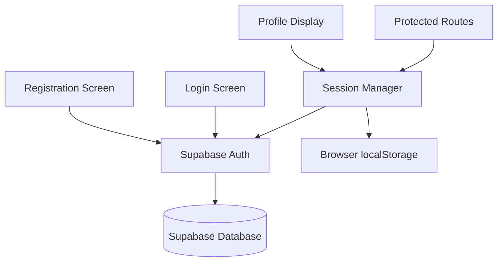
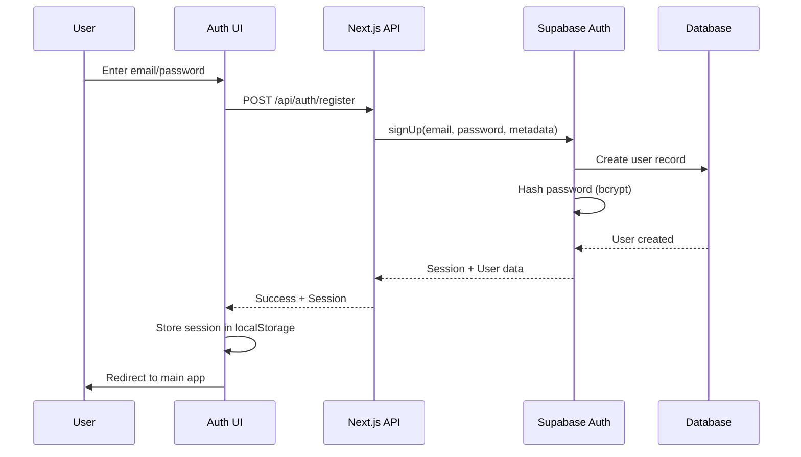
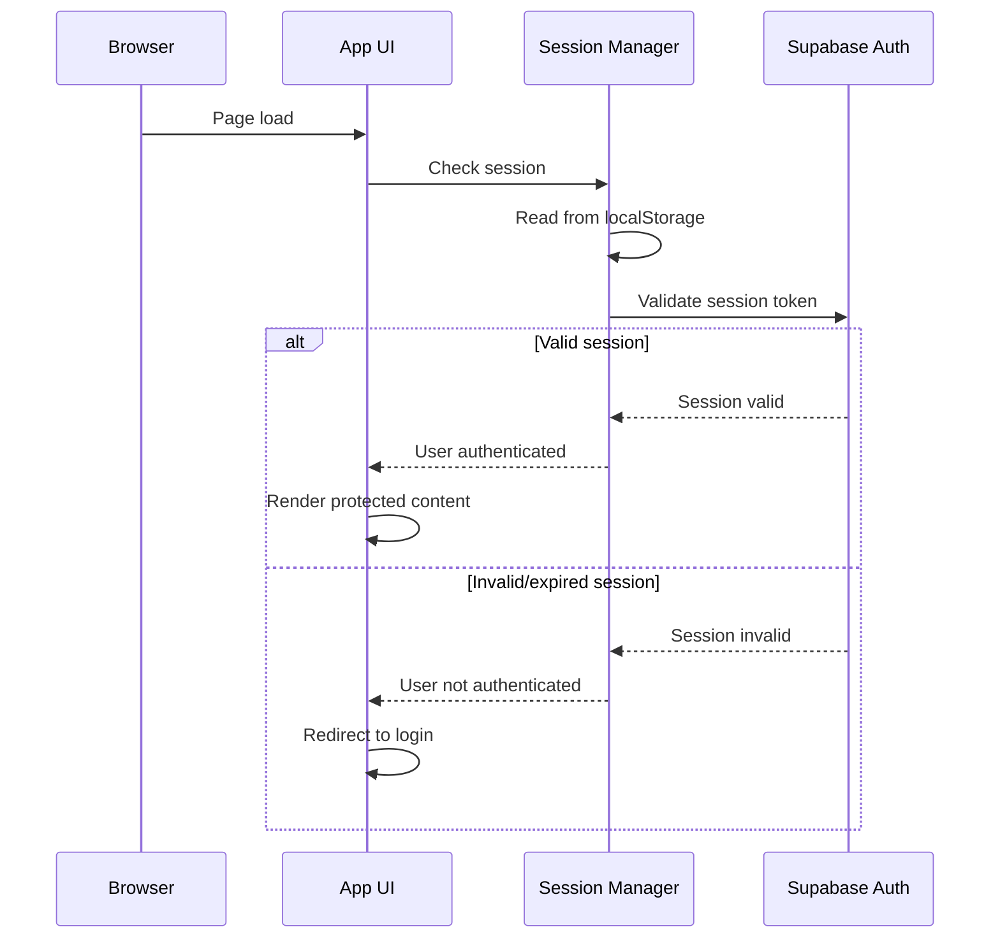

# Design: User Authentication

## Overview

The User Authentication feature enables property managers to create accounts, log in, and maintain secure sessions while using E-Kost. This feature establishes account ownership visibility through profile display and provides the foundation for future multi-user collaboration capabilities.

### Key Design Decisions

**Authentication Provider**: Supabase Auth is used for all authentication operations, providing email/password authentication with minimal setup (5 minutes vs 4-8 hours for custom implementation). Supabase Auth handles password hashing (bcrypt), session management, and HTTPS transmission automatically.

**Session Strategy**: Sessions persist for 30 days using Supabase's built-in session management with automatic token refresh. Sessions are stored in browser localStorage and maintained across browser sessions without requiring server-side session storage.

**Mobile-First UI**: All authentication screens use single-column layouts optimized for 320px-480px widths with 44x44px minimum touch targets. Form fields stack vertically with appropriate keyboard types (email keyboard for email fields, secure text entry for passwords).

**Profile Display**: User account information is displayed via a profile icon in the application header, showing initials or avatar with a dropdown containing name, email, and logout functionality. This provides immediate visibility of whose account is active.

**Security**: Passwords are hashed using bcrypt (via Supabase Auth), transmitted over HTTPS only, and never stored in plain text. Minimum password length is 8 characters, enforced at both client and server levels.

## Architecture

### System Context

The User Authentication feature integrates with Supabase Auth service and establishes the foundation for all protected application features:



### Authentication Flow



### Session Management Flow



## Components and Interfaces

### 1. Authentication Service

**Responsibility**: Handle all authentication operations via Supabase Auth client.

**Interface**:
```typescript
interface AuthService {
  // Register new user
  register(email: string, password: string, name: string): Promise<AuthResult>;
  
  // Log in existing user
  login(email: string, password: string): Promise<AuthResult>;
  
  // Log out current user
  logout(): Promise<void>;
  
  // Get current session
  getSession(): Promise<Session | null>;
  
  // Get current user
  getCurrentUser(): Promise<User | null>;
}

interface AuthResult {
  user: User;
  session: Session;
}

interface User {
  id: string;
  email: string;
  name: string;
  createdAt: string;
}

interface Session {
  accessToken: string;
  refreshToken: string;
  expiresAt: number;
}
```

**Implementation Notes**:
- Uses Supabase Auth client library (@supabase/supabase-js)
- Password hashing handled automatically by Supabase
- Session tokens stored in localStorage via Supabase client
- Automatic token refresh before expiration

### 2. Session Manager

**Responsibility**: Manage session state, validate authentication, and handle session persistence.

**Interface**:
```typescript
interface SessionManager {
  // Initialize session from storage
  initialize(): Promise<void>;
  
  // Check if user is authenticated
  isAuthenticated(): boolean;
  
  // Get current user
  getUser(): User | null;
  
  // Clear session (logout)
  clearSession(): void;
  
  // Refresh session token
  refreshSession(): Promise<void>;
}
```

**Implementation Notes**:
- React Context provider for session state
- Automatic session refresh 5 minutes before expiration
- Redirects to login on session expiration
- Clears localStorage on logout

### 3. API Routes

**POST /api/auth/register**
- Creates new user account with email, password, and name
- Validates email format and password length
- Returns session and user data on success
- Response time: <2 seconds

**POST /api/auth/login**
- Authenticates user with email and password
- Creates session with 30-day expiration
- Returns session and user data on success
- Response time: <2 seconds

**POST /api/auth/logout**
- Terminates current session
- Clears session from Supabase
- Response time: <1 second

**GET /api/auth/session**
- Returns current session and user data
- Validates session token
- Response time: <500ms

**Request/Response Schemas**:
```typescript
// POST /api/auth/register
interface RegisterRequest {
  email: string;
  password: string;
  name: string;
}

interface RegisterResponse {
  user: User;
  session: Session;
}

// POST /api/auth/login
interface LoginRequest {
  email: string;
  password: string;
}

interface LoginResponse {
  user: User;
  session: Session;
}

// Error Response
interface ErrorResponse {
  error: string;
  code: string;
}
```

### 4. UI Components

**RegistrationForm Component**
- Form with fields: name, email, password
- Client-side validation: required fields, email format, password length
- Displays validation errors inline
- Submit button with loading state
- Mobile-optimized: single column, 44x44px touch targets
- Appropriate keyboard types (email, secure text)

**LoginForm Component**
- Form with fields: email, password
- Client-side validation: required fields
- Displays authentication errors
- Submit button with loading state
- Mobile-optimized: single column, 44x44px touch targets
- Appropriate keyboard types (email, secure text)

**ProfileIcon Component**
- Displays user initials or avatar image
- Minimum 44x44px dimensions for touch
- Click/tap opens profile dropdown
- Positioned in application header

**ProfileDropdown Component**
- Displays user name and email
- Logout button with 44x44px minimum
- Closes on outside click
- Mobile-optimized positioning

**ProtectedRoute Component**
- Wraps protected pages/components
- Checks authentication status
- Redirects to login if not authenticated
- Shows loading state during session check

## Data Models

### Database Schema

Supabase Auth manages user accounts in its built-in `auth.users` table. We extend this with a custom `profiles` table for additional user metadata:

```sql
-- Supabase Auth built-in table (managed by Supabase)
-- auth.users (
--   id UUID PRIMARY KEY,
--   email VARCHAR(255) UNIQUE,
--   encrypted_password VARCHAR(255),
--   email_confirmed_at TIMESTAMP,
--   created_at TIMESTAMP,
--   updated_at TIMESTAMP,
--   last_sign_in_at TIMESTAMP
-- )

-- Custom profiles table for additional user data
CREATE TABLE profiles (
  id UUID PRIMARY KEY REFERENCES auth.users(id) ON DELETE CASCADE,
  name VARCHAR(255) NOT NULL,
  avatar_url VARCHAR(500),
  created_at TIMESTAMP DEFAULT NOW(),
  updated_at TIMESTAMP DEFAULT NOW()
);

-- Enable Row Level Security
ALTER TABLE profiles ENABLE ROW LEVEL SECURITY;

-- Policy: Users can read their own profile
CREATE POLICY "Users can read own profile"
  ON profiles FOR SELECT
  USING (auth.uid() = id);

-- Policy: Users can update their own profile
CREATE POLICY "Users can update own profile"
  ON profiles FOR UPDATE
  USING (auth.uid() = id);

-- Trigger to create profile on user registration
CREATE OR REPLACE FUNCTION public.handle_new_user()
RETURNS TRIGGER AS $$
BEGIN
  INSERT INTO public.profiles (id, name)
  VALUES (NEW.id, NEW.raw_user_meta_data->>'name');
  RETURN NEW;
END;
$$ LANGUAGE plpgsql SECURITY DEFINER;

CREATE TRIGGER on_auth_user_created
  AFTER INSERT ON auth.users
  FOR EACH ROW EXECUTE FUNCTION public.handle_new_user();
```

### Indexes for Performance

```sql
-- Index on profiles for user lookup
CREATE INDEX idx_profiles_id ON profiles(id);

-- Supabase Auth automatically indexes auth.users(email)
```

### Data Flow

1. **User Registration**: 
   - UI submits email, password, name → API calls Supabase Auth signUp
   - Supabase creates auth.users record with hashed password
   - Trigger creates profiles record with name
   - Supabase returns session + user data
   - UI stores session in localStorage

2. **User Login**:
   - UI submits email, password → API calls Supabase Auth signInWithPassword
   - Supabase validates credentials
   - Supabase returns session + user data
   - UI stores session in localStorage

3. **Session Validation**:
   - App loads → Session Manager reads localStorage
   - Session Manager calls Supabase Auth getSession
   - Supabase validates token and returns user data
   - If valid: render protected content
   - If invalid: redirect to login

4. **User Logout**:
   - UI calls logout → API calls Supabase Auth signOut
   - Supabase invalidates session
   - UI clears localStorage
   - UI redirects to login

### Session Storage

Sessions are stored in browser localStorage by Supabase Auth client:

```typescript
// Stored by Supabase client automatically
localStorage.setItem('supabase.auth.token', JSON.stringify({
  access_token: 'jwt-token',
  refresh_token: 'refresh-token',
  expires_at: 1234567890,
  user: { id: 'uuid', email: 'user@example.com' }
}));
```

### User Metadata

User metadata (name) is stored in Supabase Auth's `raw_user_meta_data` field during registration:

```typescript
const { data, error } = await supabase.auth.signUp({
  email: 'user@example.com',
  password: 'password123',
  options: {
    data: {
      name: 'John Doe'
    }
  }
});
```


## Correctness Properties

*A property is a characteristic or behavior that should hold true across all valid executions of a system—essentially, a formal statement about what the system should do. Properties serve as the bridge between human-readable specifications and machine-verifiable correctness guarantees.*

### Property 1: Successful Registration Creates Session

*For any* valid registration data (name, email, password ≥8 characters), submitting the registration form should create a new user account and return a valid session with access token, refresh token, and 30-day expiration.

**Validates: Requirements 1.2, 1.6, 1.7, 3.1**

### Property 2: Form Validation Rejects Missing Fields

*For any* authentication form (registration or login) with one or more required fields missing, form submission should be prevented and validation errors should be displayed for each missing field.

**Validates: Requirements 1.3, 2.4**

### Property 3: Password Length Validation

*For any* password string with length less than 8 characters, the registration form should reject the submission and display a validation error indicating the minimum length requirement.

**Validates: Requirements 1.5**

### Property 4: Successful Login Creates Persistent Session

*For any* valid email and password combination for an existing user, submitting the login form should authenticate the user and create a session that persists in localStorage with a 30-day expiration.

**Validates: Requirements 2.2, 2.5, 2.6, 3.1**

### Property 5: Invalid Credentials Rejected

*For any* email and password combination that does not match an existing user account, the login attempt should be rejected and an error message indicating invalid credentials should be displayed.

**Validates: Requirements 2.3**

### Property 6: Protected Route Access Control

*For any* protected application route, accessing the route without an active session should redirect to the login interface, and accessing with an active session should allow access without re-authentication.

**Validates: Requirements 3.4, 3.5, 5.4**

### Property 7: Profile Icon Displays Initials

*For any* user with a name, the profile icon should display the user's initials derived from the first letter of each word in the name (e.g., "John Doe" → "JD").

**Validates: Requirements 4.2**

### Property 8: Logout Clears Session

*For any* authenticated user, clicking the logout button should terminate the session, clear all session data from localStorage, and redirect to the login interface.

**Validates: Requirements 5.2, 5.3**

### Property 9: Touch Target Minimum Dimensions

*For any* interactive element on authentication screens (buttons, links, profile icon), the rendered element should have minimum dimensions of 44x44 pixels to ensure comfortable touch interaction.

**Validates: Requirements 6.3, 4.5**

### Property 10: Login Timestamp Recording

*For any* successful login, the system should record a timestamp indicating when the login occurred.

**Validates: Requirements 2.6**

## Error Handling

### Authentication Errors

**Invalid Email Format**:
- Scenario: User enters malformed email address
- Handling: Client-side validation prevents submission
- Message: "Please enter a valid email address"
- UI: Display error below email field

**Email Already Registered**:
- Scenario: User attempts to register with existing email
- Handling: Supabase Auth returns error, API forwards to client
- Message: "This email is already registered. Please log in instead."
- UI: Display error below email field with link to login page

**Invalid Login Credentials**:
- Scenario: User enters wrong email or password
- Handling: Supabase Auth returns error, API forwards to client
- Message: "Invalid email or password. Please try again."
- UI: Display error at top of form (don't specify which field is wrong for security)

**Password Too Short**:
- Scenario: User enters password with fewer than 8 characters
- Handling: Client-side validation prevents submission
- Message: "Password must be at least 8 characters long"
- UI: Display error below password field

**Missing Required Fields**:
- Scenario: User attempts to submit form with empty fields
- Handling: Client-side validation prevents submission
- Message: "This field is required" (per field)
- UI: Display error below each empty required field

### Session Errors

**Session Expired**:
- Scenario: User's session expires after 30 days
- Handling: Session Manager detects expired token
- Message: "Your session has expired. Please log in again."
- UI: Redirect to login page with message displayed

**Invalid Session Token**:
- Scenario: Session token is corrupted or invalid
- Handling: Supabase Auth validation fails
- Message: "Your session is invalid. Please log in again."
- UI: Clear localStorage, redirect to login page

**Network Timeout**:
- Scenario: Authentication request takes longer than 5 seconds
- Handling: Client-side timeout cancels request
- Message: "Request timed out. Please check your connection and try again."
- UI: Display error with retry button

### Database Errors

**Profile Creation Failure**:
- Scenario: User account created but profile record fails to insert
- Handling: Database trigger failure, transaction rollback
- Message: "Account creation failed. Please try again."
- UI: Display error on registration form
- Logging: Log error details for debugging

**Connection Failure**:
- Scenario: Cannot connect to Supabase
- Handling: API returns 503 Service Unavailable
- Message: "Service temporarily unavailable. Please try again in a moment."
- UI: Display error with retry button
- Retry: Implement exponential backoff (1s, 2s, 4s)

### UI Errors

**Missing Translation Keys**:
- Scenario: Translation key not found in locale file
- Handling: Fall back to English key or display key name
- Logging: Log missing keys for developer attention
- UI: Display fallback text without breaking layout

**Component Rendering Failure**:
- Scenario: React component fails to render
- Handling: Error boundary catches error
- Fallback: Display simplified error message
- Logging: Log error details with stack trace

### Security Errors

**CSRF Token Mismatch** (Future):
- Scenario: Request CSRF token doesn't match session
- Handling: Reject request with 403 Forbidden
- Message: "Security validation failed. Please refresh and try again."
- UI: Redirect to login page

**Rate Limiting** (Future):
- Scenario: Too many login attempts from same IP
- Handling: Temporarily block requests
- Message: "Too many login attempts. Please try again in 15 minutes."
- UI: Display error with countdown timer

## Testing Strategy

### Dual Testing Approach

This feature requires both unit tests and property-based tests to ensure comprehensive coverage:

**Unit Tests**: Focus on specific examples, edge cases, and integration points
- Example: Registration with valid data creates account
- Example: Login with valid credentials returns session
- Example: Duplicate email registration shows error
- Example: Session expiration redirects to login
- Edge case: Empty form submission shows validation errors
- Integration: API routes return correct response formats

**Property-Based Tests**: Verify universal properties across all inputs
- Property tests handle comprehensive input coverage through randomization
- Each property test runs minimum 100 iterations
- Properties validate correctness across the full input space

### Property-Based Testing Configuration

**Library**: fast-check (JavaScript/TypeScript property-based testing library)

**Configuration**:
```typescript
import fc from 'fast-check';

// Minimum 100 iterations per property test
fc.assert(property, { numRuns: 100 });
```

**Test Tagging**: Each property test must include a comment referencing the design property:
```typescript
// Feature: user-authentication, Property 1: Successful Registration Creates Session
test('valid registration creates account and session', () => {
  fc.assert(
    fc.property(
      validUserDataArbitrary,
      async (userData) => {
        const result = await authService.register(
          userData.email,
          userData.password,
          userData.name
        );
        
        expect(result.user).toBeDefined();
        expect(result.user.email).toBe(userData.email);
        expect(result.session).toBeDefined();
        expect(result.session.accessToken).toBeTruthy();
        expect(result.session.expiresAt).toBeGreaterThan(Date.now());
      }
    ),
    { numRuns: 100 }
  );
});
```

### Test Coverage Requirements

**Unit Tests**:
- Registration flow with various scenarios (5-8 tests)
- Login flow with various scenarios (5-8 tests)
- Session management (5-7 tests)
- Profile display (3-5 tests)
- Logout flow (3-5 tests)
- Form validation (5-8 tests)
- Error handling scenarios (8-12 tests)
- UI component rendering (8-12 tests)

**Property-Based Tests**:
- One test per correctness property (10 tests total)
- Each test runs 100+ iterations
- Generators for: user data, credentials, sessions, form inputs

**Integration Tests**:
- End-to-end registration flow (1-2 tests)
- End-to-end login flow (1-2 tests)
- Session persistence across page reloads (1-2 tests)
- Protected route access control (2-3 tests)

### Test Data Generators

**Valid User Data Generator**:
```typescript
const validUserDataArbitrary = fc.record({
  name: fc.string({ minLength: 1, maxLength: 100 }),
  email: fc.emailAddress(),
  password: fc.string({ minLength: 8, maxLength: 50 })
});
```

**Invalid Email Generator**:
```typescript
const invalidEmailArbitrary = fc.oneof(
  fc.string().filter(s => !s.includes('@')),
  fc.constant(''),
  fc.constant('invalid'),
  fc.constant('test@')
);
```

**Short Password Generator**:
```typescript
const shortPasswordArbitrary = fc.string({ 
  minLength: 0, 
  maxLength: 7 
});
```

**Session Generator**:
```typescript
const sessionArbitrary = fc.record({
  accessToken: fc.uuid(),
  refreshToken: fc.uuid(),
  expiresAt: fc.integer({ min: Date.now(), max: Date.now() + 30 * 24 * 60 * 60 * 1000 })
});
```

**Form Input Generator** (with missing fields):
```typescript
const formInputWithMissingFieldsArbitrary = fc.record({
  name: fc.option(fc.string(), { nil: '' }),
  email: fc.option(fc.emailAddress(), { nil: '' }),
  password: fc.option(fc.string({ minLength: 8 }), { nil: '' })
}).filter(input => !input.name || !input.email || !input.password);
```

### Mobile Testing

**Responsive Design**:
- Test layouts at 320px, 375px, 414px, 480px widths
- Verify single-column layout on all mobile widths
- Verify no horizontal scrolling required
- Test form field stacking and spacing

**Touch Targets**:
- Verify all buttons are 44x44px minimum
- Verify profile icon is 44x44px minimum
- Verify form inputs have adequate touch area
- Test tap interactions on mobile devices

**Keyboard Types**:
- Verify email fields use `type="email"` (triggers email keyboard)
- Verify password fields use `type="password"` (triggers secure text entry)
- Test on iOS and Android devices

**Accessibility**:
- Test with screen readers (VoiceOver, TalkBack)
- Verify all form fields have associated labels
- Verify error messages are announced
- Test keyboard navigation for all interactive elements
- Verify color contrast meets WCAG AA standards

### Security Testing

**Password Security**:
- Verify passwords are never logged
- Verify passwords are never displayed in plain text
- Verify password fields use `type="password"`
- Verify HTTPS is enforced (infrastructure test)

**Session Security**:
- Verify sessions expire after 30 days
- Verify expired sessions redirect to login
- Verify logout clears all session data
- Verify session tokens are not exposed in URLs

**Input Validation**:
- Test SQL injection attempts (should be prevented by Supabase)
- Test XSS attempts in name field
- Test email format validation
- Test password length validation

### Performance Testing

**Response Time**:
- Registration completes in <2 seconds
- Login completes in <2 seconds
- Logout completes in <1 second
- Session validation completes in <500ms

**Load Testing**:
- Test with 100 concurrent registrations
- Test with 100 concurrent logins
- Verify no performance degradation
- Monitor Supabase connection pool

## Implementation Notes

### Technology Stack Integration

**Frontend**:
- React 18 components for authentication UI
- React Hook Form for form handling and validation
- Zod for schema validation
- Tailwind CSS for mobile-first styling
- react-i18next for translation keys
- Supabase Auth client (@supabase/supabase-js)

**Backend**:
- Next.js API routes for authentication endpoints
- Supabase Auth for user management
- Prisma for profiles table access
- Zod for request/response validation

**Database**:
- Supabase PostgreSQL for profiles table
- Supabase Auth built-in tables for user accounts
- Row Level Security (RLS) for data protection

### Supabase Auth Configuration

**Client Initialization**:
```typescript
import { createClient } from '@supabase/supabase-js';

const supabase = createClient(
  process.env.NEXT_PUBLIC_SUPABASE_URL!,
  process.env.NEXT_PUBLIC_SUPABASE_ANON_KEY!,
  {
    auth: {
      persistSession: true,
      autoRefreshToken: true,
      detectSessionInUrl: true,
      storage: window.localStorage,
      storageKey: 'ekost-auth-token'
    }
  }
);
```

**Session Configuration**:
- Session duration: 30 days (2,592,000 seconds)
- Auto-refresh: Enabled (refreshes 5 minutes before expiration)
- Storage: localStorage (persists across browser sessions)
- Storage key: 'ekost-auth-token'

### React Hook Form Integration

**Registration Form**:
```typescript
import { useForm } from 'react-hook-form';
import { zodResolver } from '@hookform/resolvers/zod';
import { z } from 'zod';

const registrationSchema = z.object({
  name: z.string().min(1, 'Name is required'),
  email: z.string().email('Invalid email address'),
  password: z.string().min(8, 'Password must be at least 8 characters')
});

type RegistrationFormData = z.infer<typeof registrationSchema>;

function RegistrationForm() {
  const { register, handleSubmit, formState: { errors } } = useForm<RegistrationFormData>({
    resolver: zodResolver(registrationSchema)
  });

  const onSubmit = async (data: RegistrationFormData) => {
    const result = await authService.register(data.email, data.password, data.name);
    // Handle success
  };

  return (
    <form onSubmit={handleSubmit(onSubmit)}>
      <input {...register('name')} />
      {errors.name && <span>{errors.name.message}</span>}
      
      <input {...register('email')} type="email" />
      {errors.email && <span>{errors.email.message}</span>}
      
      <input {...register('password')} type="password" />
      {errors.password && <span>{errors.password.message}</span>}
      
      <button type="submit">Register</button>
    </form>
  );
}
```

### Session Management with React Context

**Auth Context Provider**:
```typescript
import { createContext, useContext, useEffect, useState } from 'react';
import { User, Session } from '@supabase/supabase-js';

interface AuthContextType {
  user: User | null;
  session: Session | null;
  loading: boolean;
  signIn: (email: string, password: string) => Promise<void>;
  signUp: (email: string, password: string, name: string) => Promise<void>;
  signOut: () => Promise<void>;
}

const AuthContext = createContext<AuthContextType | undefined>(undefined);

export function AuthProvider({ children }: { children: React.ReactNode }) {
  const [user, setUser] = useState<User | null>(null);
  const [session, setSession] = useState<Session | null>(null);
  const [loading, setLoading] = useState(true);

  useEffect(() => {
    // Check active session
    supabase.auth.getSession().then(({ data: { session } }) => {
      setSession(session);
      setUser(session?.user ?? null);
      setLoading(false);
    });

    // Listen for auth changes
    const { data: { subscription } } = supabase.auth.onAuthStateChange(
      (_event, session) => {
        setSession(session);
        setUser(session?.user ?? null);
      }
    );

    return () => subscription.unsubscribe();
  }, []);

  const value = {
    user,
    session,
    loading,
    signIn: async (email, password) => {
      const { data, error } = await supabase.auth.signInWithPassword({
        email,
        password
      });
      if (error) throw error;
    },
    signUp: async (email, password, name) => {
      const { data, error } = await supabase.auth.signUp({
        email,
        password,
        options: { data: { name } }
      });
      if (error) throw error;
    },
    signOut: async () => {
      const { error } = await supabase.auth.signOut();
      if (error) throw error;
    }
  };

  return <AuthContext.Provider value={value}>{children}</AuthContext.Provider>;
}

export const useAuth = () => {
  const context = useContext(AuthContext);
  if (context === undefined) {
    throw new Error('useAuth must be used within an AuthProvider');
  }
  return context;
};
```

### Protected Route Component

```typescript
import { useAuth } from '@/contexts/AuthContext';
import { useRouter } from 'next/router';
import { useEffect } from 'react';

export function ProtectedRoute({ children }: { children: React.ReactNode }) {
  const { user, loading } = useAuth();
  const router = useRouter();

  useEffect(() => {
    if (!loading && !user) {
      router.push('/login');
    }
  }, [user, loading, router]);

  if (loading) {
    return <div>Loading...</div>;
  }

  if (!user) {
    return null;
  }

  return <>{children}</>;
}
```

### Profile Icon Component

```typescript
function ProfileIcon() {
  const { user } = useAuth();
  const [showDropdown, setShowDropdown] = useState(false);

  const getInitials = (name: string) => {
    return name
      .split(' ')
      .map(word => word[0])
      .join('')
      .toUpperCase()
      .slice(0, 2);
  };

  const initials = user?.user_metadata?.name 
    ? getInitials(user.user_metadata.name)
    : '??';

  return (
    <div className="relative">
      <button
        onClick={() => setShowDropdown(!showDropdown)}
        className="min-w-[44px] min-h-[44px] rounded-full bg-blue-500 text-white flex items-center justify-center font-semibold"
        aria-label="User profile"
      >
        {initials}
      </button>
      
      {showDropdown && (
        <div className="absolute right-0 mt-2 w-64 bg-white rounded-lg shadow-lg p-4">
          <p className="font-semibold">{user?.user_metadata?.name}</p>
          <p className="text-sm text-gray-600">{user?.email}</p>
          <button
            onClick={handleLogout}
            className="mt-4 w-full min-h-[44px] bg-red-500 text-white rounded"
          >
            Logout
          </button>
        </div>
      )}
    </div>
  );
}
```

### Mobile-First CSS

**Tailwind Configuration**:
```css
/* Mobile-first: default styles for 320px+ */
.auth-form {
  @apply flex flex-col gap-4 p-4 w-full max-w-md mx-auto;
}

.auth-input {
  @apply w-full min-h-[44px] px-4 py-2 border border-gray-300 rounded;
}

.auth-button {
  @apply w-full min-h-[44px] bg-blue-500 text-white rounded font-semibold;
}

.auth-error {
  @apply text-red-500 text-sm mt-1;
}
```

**Touch Target Enforcement**:
```css
/* Ensure all interactive elements meet 44x44px minimum */
button, a, input[type="submit"] {
  @apply min-w-[44px] min-h-[44px];
}
```

### Internationalization

**Translation Keys**:
```json
{
  "auth.register.title": "Create Account",
  "auth.register.name": "Full Name",
  "auth.register.email": "Email Address",
  "auth.register.password": "Password",
  "auth.register.submit": "Register",
  "auth.login.title": "Log In",
  "auth.login.email": "Email Address",
  "auth.login.password": "Password",
  "auth.login.submit": "Log In",
  "auth.logout": "Log Out",
  "auth.profile.title": "Account",
  "auth.validation.required": "This field is required",
  "auth.validation.email": "Please enter a valid email address",
  "auth.validation.passwordLength": "Password must be at least 8 characters",
  "auth.error.emailExists": "This email is already registered",
  "auth.error.invalidCredentials": "Invalid email or password",
  "auth.error.sessionExpired": "Your session has expired. Please log in again.",
  "auth.success.logout": "You have been logged out successfully"
}
```

**Usage in Components**:
```typescript
import { useTranslation } from 'react-i18next';

function RegistrationForm() {
  const { t } = useTranslation();
  
  return (
    <form>
      <h1>{t('auth.register.title')}</h1>
      <label>{t('auth.register.name')}</label>
      <input type="text" />
      {/* ... */}
    </form>
  );
}
```

### Security Considerations

**Password Handling**:
- Never log passwords
- Never display passwords in plain text
- Always use `type="password"` for password inputs
- Passwords transmitted over HTTPS only (enforced by Supabase)
- Passwords hashed with bcrypt by Supabase Auth

**Session Security**:
- Sessions stored in localStorage (not sessionStorage for persistence)
- Session tokens are JWT with expiration
- Automatic token refresh before expiration
- Logout clears all session data

**Input Sanitization**:
- Zod validation prevents malformed data
- React automatically escapes JSX content (XSS protection)
- Supabase uses parameterized queries (SQL injection protection)

**Row Level Security**:
- Profiles table uses RLS policies
- Users can only read/update their own profile
- Enforced at database level

### Performance Optimization

**Code Splitting**:
- Lazy load authentication components
- Separate bundle for auth pages
- Reduce initial bundle size

**Caching**:
- Cache user profile data in React Context
- Avoid redundant session validation calls
- Use SWR or React Query for data fetching

**Optimistic UI Updates**:
- Show loading states immediately
- Update UI before API response
- Rollback on error

### Deployment Considerations

**Environment Variables**:
```env
NEXT_PUBLIC_SUPABASE_URL=https://your-project.supabase.co
NEXT_PUBLIC_SUPABASE_ANON_KEY=your-anon-key
```

**Database Setup**:
1. Create profiles table with RLS policies
2. Create trigger for automatic profile creation
3. Test trigger with sample user registration

**Supabase Configuration**:
1. Enable email/password authentication
2. Configure session duration (30 days)
3. Set up email templates (future: password reset, verification)
4. Configure CORS for Next.js domain

**Monitoring**:
- Track authentication success/failure rates
- Monitor session creation and expiration
- Alert on high error rates
- Track response times for auth operations

## Future Enhancements

**Out of Scope for MVP**:
- OAuth/social login (Google, Facebook, GitHub)
- Two-factor authentication (2FA)
- Password reset flow via email
- Email verification
- Account deletion or deactivation
- User profile editing (name, avatar)
- Role-based access control (RBAC)
- Team invitation and collaboration
- Multi-property assignment
- Admin user management
- Audit log for authentication events
- Account recovery options
- Remember me checkbox
- Login history tracking

**Post-MVP Considerations**:
- Add password reset flow with email verification
- Implement email verification for new accounts
- Add OAuth providers for easier login
- Implement 2FA for enhanced security
- Add user profile editing capabilities
- Build admin dashboard for user management
- Add role-based permissions for collaboration
- Implement team invitation system
- Add audit logging for compliance
- Build account recovery mechanisms
